# README

​		本人对[周志华教授的机械学习笔记](周志华《机器学习》学习笔记.pdf)进行学习，并对其做出自己的总结，目前可能完成不了，每周抽时间完成一部分。先对基础及部分算法进行学习，写下此笔记及框架。可以搭配[官方文档](scikit-learn (sklearn) 0.21.3 官方文档中文版.pdf)学习。

# 机械学习笔记

## 一、 初入机械学习

### 1、定义

​		机械学习：计算机通过一些数据集的的训练测试产生一个算法模型，面对新的情况，能够做出有效判断

​		就比如周志华教授以人买瓜为例，要从西瓜里挑到好瓜就得有挑瓜的经验，从根蒂形状到色泽斑纹，再到拍击的声响，从经验中判断瓜的好坏。经验就相当于计算机中的数据集，经过多次经验累加（训练）判断出好瓜（任务目标）。

### 2、基本术语

​		这里引用周志华教授的讲解，一批西瓜的会有一些数据，例如：（色泽=青绿;根蒂=蜷缩;敲声=浊响)， (色泽=乌黑;根蒂=稍蜷;敲声=沉闷)， (色泽=浅自;根蒂=硬挺;敲声=清脆)……每对括号内是一个西瓜的记录，定义：

​	所有记录的集合为：数据集。

​		 每一条记录为：一个实例（instance）或样本（sample）。

​	单个的特点为特征（feature）或属性（attribute）， 例如：色泽或敲声。

​		对于一条记录，如果在坐标轴上表示，每个西瓜都可以用坐标轴中的一个点表示，一个点也是一个向量，例如 （青绿，蜷缩，浊响），即每个西瓜为：一个特征向量（feature vector）。

​		一个样本的特征数为：维数（dimensionality），该西瓜的例子维数为3，当维数非常大时，也就是现在说 的“维数灾难”。

------

​		 计算机程序学习经验数据生成算法模型的过程中，每一条记录称为一个“训练样本”，同时在训练好模型后，我 们希望使用新的样本来测试模型的效果，则每一个新的样本称为一个“测试样本”。定义：

​		所有训练样本的集合为：训练集（training set），[特殊]。

​		所有测试样本的集合为：测试集（test set），[一般]。

​		 机器学习出来的模型适用于新样本的能力为：泛化能力（generalization），即**从特殊到一般**。

​	西瓜的例子中，我们是想计算机通过学习西瓜的特征数据，训练出一个决策模型，来判断一个新的西瓜是否为好瓜。可以得知我们预测的是：西瓜是好是坏，即好瓜与差瓜两种，是<u>离散值</u>。同样地，也有通过历年的人口数据，来预测未来的人口数量，人口数量则是<u>连续值</u>。定义：

​		 预测值为离散值的问题为：**分类**（classification）。

​		 预测值为连续值的问题为：**回归**（regression）。

​	我们预测西瓜是否是好瓜的过程中，很明显对于训练集中的西瓜，我们事先已经知道了该瓜是否是好瓜，学习器通过学习这些好瓜或差瓜的特征，从而总结出规律，即训练集中的西瓜我们都做了标记，称为标记信息。但也有没有标记信息的情形，例如：我们想将一堆西瓜根据特征分成两个小堆，使得某一堆的西瓜尽可能相似，即都是好瓜或差瓜，对于这种问题，我们事先并不知道西瓜的好坏，样本没有标记信息。定义： 

​		训练数据**有标记信息的**学习任务为：**监督学习**（supervised learning），容易知道上面所描述的<u>分类和回归</u>都是监督学习的范畴。 

​		训练数据**没有标记信息的**学习任务为：**无监督学习**（unsupervised learning），常见的有<u>聚类和关联规则</u>。

#### 1、监督学习与无监督学习

1. **[监督学习](https://easyai.tech/ai-definition/supervised-learning/)**是一种目的明确的训练方式，你知道得到的是什么；而**[无监督学习](https://easyai.tech/ai-definition/unsupervised-learning/)**则是没有明确目的的训练方式，你无法提前知道结果是什么。

2. **监督学习**需要给数据打标签；而**无监督学习**不需要给数据打标签。

3. **监督学习**由于目标明确，所以可以衡量效果；而**无监督学习**几乎无法量化效果如何。

   ##### 监督学习

   ​		**监督学习需要有明确的目标，很清楚自己想要什么结果**。比如：按照“既定规则”来分类、预测某个具体的值…

   ###### 使用场景:

   1、**回归**  2、**分类**

   ###### 常见算法：

   分类：**[朴素贝叶斯](https://easyai.tech/ai-definition/naive-bayes-classifier/)**、**[决策树](https://easyai.tech/ai-definition/decision-tree/)**、[**SVM**](https://easyai.tech/ai-definition/svm/)、**[逻辑回归](https://easyai.tech/ai-definition/3dataset-and-cross-validation/)**

   回归：**线性回归**、**回归树**

   分类+回归：**K邻近**、**[Adaboosting](https://easyai.tech/ai-definition/adaboost/)**、**神经网络**

   ##### 无监督学习

   ​		本质上是一个统计手段，在没有标签的数据里可以发现潜在的一些结构的一种训练方式。

   ###### 使用场景:

   1、**回归**  2、**分类**  3、**推荐系统**

   ###### 常见算法：

   **聚类**、**降维**

## 二、模型的评估与选择

### 1、误差与过拟合

​		学习器对样本的实际预测结果与样本的真实值之间一般会存在一些差异，可称为误差。定义：

​		在训练集上的误差称为<u>训练误差（training error）或经验误差（empirical error）</u>。

​		 在测试集上的误差称为<u>测试误差（test error）</u>。

​		 学习器在所有新样本上的误差称为<u>泛化误差（generalization error）</u>。

------

​		显然，我们希望得到的是在新样本上表现得很好的学习器，即泛化误差小的学习器。因此，我们应该让学习器尽可能 地从训练集中学出普适性的**“一般特征”**，这样在遇到新样本时才能做出正确的判别。然而，当学习器把训练集学得“太好”的时候，即把一些训练样本的自身特点当做了普遍特征；同时也有学习能力不足的情况，即训练集的基本特征都没有学习出来。拿个例子来讲，训练集是一些树叶，而过拟合是把某种树叶的特征作为树叶的特征，欠拟合则是把绿色（太过宽泛干扰多的特征）作为树叶的特征。我们定义：

​		学习能力过强，以至于把训练样本所包含的不太一般的特性都学到了，称为：过拟合（overfitting）。太过刻意，而失去了自身的普遍性。 

​		学习能太差，训练样本的一般性质尚未学好，称为：欠拟合（underfitting）。

​	在过拟合问题中，训练误差十分小，但测试误差教大；在欠拟合问题中，训练误差和测试误差都比较大。 目前，欠拟合问题比较容易克服，例如增加迭代次数等，但过拟合问题还没有十分好的解决方案，过拟合是机器学习面临的关键障碍。


### 2、评估方法

​		要找到最适合的算法，来解决现实中的问题。如上所述，我们希望得到的是泛化误差小的学习器，目标是对模型的泛化误差进行评估，然后选择泛化误差最小的那个学习器。但是，泛化误差指的是模型在所有新样本上的适用能力，我们无法直接获得泛化误差。

​		因此，通常我们采用一个“测试集”来测试学习器对新样本的判别能力，然后以“测试集”上的“测试误差”作为“泛化误差”的近似值。显然：我们选取的测试集应尽可能与训练集互斥。比如考试，考的都是作业做过的测试和与作业解法类似的测试，利用考试得出的结果分析学生的真实水平还是第二种更有意义我们希望学生（学习器）能够举一反三，触类旁通，而不仅仅是训练他们在这方面的性能，否则以第一种，得出的结果太过乐观。

### 3、训练集与测试集划分

​		我们希望用一个“测试集”的“测试误差”来作为“泛化误差”的近似，因此我们需要对初始数据集进行有效划分，划分出互斥的“训练集”和“测试集”。有留出法、交叉验证发以及自助法。[训练集、验证集、测试集（附：分割方法+交叉验证）](https://easyai.tech/ai-definition/3dataset-and-cross-validation/)

#### 3.1 留出法

​		就是把数据集D分成互斥的两个集合S和T，一个做测试集，一个做训练集。数学语言描述：
$$
D=S∪T,S∩T=\emptyset 
$$
​		常见的划分为：大 约2/3-4/5的样本用作训练，剩下的测试。需要注：训练/测试集的划分要尽可能保持数据分布的一致性， 以避免由于分布的差异引入额外的偏差，常见的做法是采取分层抽样。同时，由于划分的随机性，单次的留出法结果往往不够稳定，一般要采用若干次随机划分，重复实验取平均值的做法。

#### 3.2 交叉验证法

​		就是分成k个大小相同的互斥子集，同样地尽可能保持数据分 布的一致性，即采用分层抽样的方法获得这些子集。k-1个子集做训练集，余下做测试集，从而可进行k次训练和测试，最终返回k次测试结果的均值。交叉验证法也称“k折交叉验证”，k通常取10。与留出法类似，将数据集D划分为K个子集的过程具有随机性，因此K折交叉验证通常也要重复p次，称为p次k折交叉验证，常见的是10次10折交叉验证。当子集只有一个样本时，就是留一法。

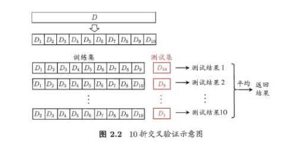

#### 3.3自助法

​		留出法和交叉验证法中，保留了一部分样本用于测试，实际评估的模型所使用的训练集比D小，这必然会引入一些因训练样本规模不同而导致的估计偏差。而留一法受影响小，但是计算复杂度太高。这里可以用自助法，含m个样本的数据集D，每次随机从D 中挑选一个样本，将其拷贝放入D’，然后再将该样本放回初始数据集D 中。就是取样后又放回初始数据集，重复m次，得到了包含m个样本的数据集D’。可以得知在m次采样中，样本始终不被采到的概率取极限为：
$$
% MathType!MTEF!2!1!+-
% feaagKart1ev2aaatCvAUfeBSjuyZL2yd9gzLbvyNv2CaerbuLwBLn
% hiov2DGi1BTfMBaeXatLxBI9gBaerbd9wDYLwzYbItLDharqqtubsr
% 4rNCHbWexLMBbXgBd9gzLbvyNv2CaeHbl7mZLdGeaGqiVu0Je9sqqr
% pepC0xbbL8F4rqqrFfpeea0xe9Lq-Jc9vqaqpepm0xbba9pwe9Q8fs
% 0-yqaqpepae9pg0FirpepeKkFr0xfr-xfr-xb9adbaqaaeGaciGaai
% aabeqaamaabaabauaakeaadaWfqaqaaiGacYgacaGGPbGaaiyBaaWc
% baGaaeyBaiabgkziUkabg6HiLcqabaGcdaqadaqaaiaaigdacqGHsi
% sldaWcaaqaaiaaigdaaeaacaWGTbaaaaGaayjkaiaawMcaamaaCaaa
% leqabaGaamyBaaaakiabgkziUoaalaaabaGaaGymaaqaaiaadwgaaa
% GaeyisISRaaGimaiaac6cacaaIZaGaaGOnaiaaiIdaaaa!5597!
\mathop {\lim }\limits_{{\rm{m}} \to \infty } {\left( {1 - \frac{1}{m}} \right)^m} \to \frac{1}{e} \approx 0.368
$$
​		这样，通过自助采样，初始样本集D中大约有36.8%的样本没有出现在D’中，于是可以将D’作为训练集，D-D’作为测 试集。自助法在数据集较小，难以有效划分训练集/测试集时很有用，但由于自助法产生的数据集（随机抽样）改变了 初始数据集的分布，因此引入了估计偏差。在初始数据集足够时，留出法和交叉验证法更加常用。

### 4、调参

​		学习算法的很多参数是在实数范围内取值，因此，对每种参数取值都训练出模型来是不可行的。常用的做法是：对每个参数选定一个范围和步长λ，这样使得学习的过程变得可行。

​		最后需要注意的是：当选定好模型和调参完成后，我们需要使用初始的数据集D重新训练模型，即让最初划分出来用于评估的测试集也被模型学习，增强模型的学习效果。

### 5、性能度量

​		性能度量（performance measure）是衡量模型泛化能力的评价标准，在对比不同模型的能力时，使用不同的性能度量往往会导致不同的评判结果。

#### 5.1 最常见的性能度量 

​		在回归任务中，即预测连续值的问题，最常用的性能度量是“均方误差”（mean squared error）,很多的经典算法 都是采用了MSE作为评价函数。
$$
% MathType!MTEF!2!1!+-
% feaagKart1ev2aaatCvAUfeBSjuyZL2yd9gzLbvyNv2CaerbuLwBLn
% hiov2DGi1BTfMBaeXatLxBI9gBaerbd9wDYLwzYbItLDharqqtubsr
% 4rNCHbWexLMBbXgBd9gzLbvyNv2CaeHbl7mZLdGeaGqiVu0Je9sqqr
% pepC0xbbL8F4rqqrFfpeea0xe9Lq-Jc9vqaqpepm0xbba9pwe9Q8fs
% 0-yqaqpepae9pg0FirpepeKkFr0xfr-xfr-xb9adbaqaaeGaciGaai
% aabeqaamaabaabauaakeaacaWGfbGaaiikaiaacAgacaGG7aGaaiir
% aiaacMcacqGH9aqpdaWcaaqaaiaaigdaaeaacaWGTbaaamaaqahaba
% GaaiikaiaacAgacaGGOaGaaiiEamaaBaaaleaacaGGPbaabeaakiaa
% cMcacqGHsislcaGG5bWaaSbaaSqaaiaadMgaaeqaaOGaaiykamaaCa
% aaleqabaGaaGOmaaaakiaac6caaSqaaiaadMgacqGH9aqpcaaIXaaa
% baGaamyBaaqdcqGHris5aaaa!56C9!
E(f;D) = \frac{1}{m}\sum\limits_{i = 1}^m {{{(f({x_i}) - {y_i})}^2}.}
$$
​		更一般的，对于数据分布D和概率密度函数p(·),均方误差可描述为
$$
% MathType!MTEF!2!1!+-
% feaagKart1ev2aaatCvAUfeBSjuyZL2yd9gzLbvyNv2CaerbuLwBLn
% hiov2DGi1BTfMBaeXatLxBI9gBaerbd9wDYLwzYbItLDharqqtubsr
% 4rNCHbWexLMBbXgBd9gzLbvyNv2CaeHbl7mZLdGeaGqiVu0Je9sqqr
% pepC0xbbL8F4rqqrFfpeea0xe9Lq-Jc9vqaqpepm0xbba9pwe9Q8fs
% 0-yqaqpepae9pg0FirpepeKkFr0xfr-xfr-xb9adbaqaaeGaciGaai
% aabeqaamaabaabauaakeaacaWGfbGaaiikaiaacAgacaGG7aGaaiir
% aiaacMcacqGH9aqpdaWdraqaaiaacIcacaGGMbGaaiikaiaacIhaca
% GGPaGaeyOeI0IaaiyEaiaacMcadaahaaWcbeqaaiaaikdaaaGccaWG
% WbGaaiikaiaadIhacaGGPaGaamizaiaadIhaaSqaaiaadIhacqWI8i
% IocaWGebaabeqdcqGHRiI8aOGaaiOlaaaa!5716!
E(f;D) = \int_{x \sim D} {{{(f(x) - y)}^2}p(x)dx} .
$$
​		在分类任务中，即预测离散值的问题，最常用的是错误率和精度，错误率是分类错误的样本数占样本总数的比例，精度则是分类正确的样本数占样本总数的比例，易知：错误率+精度=1.

​		错误率定义为
$$
% MathType!MTEF!2!1!+-
% feaagKart1ev2aaatCvAUfeBSjuyZL2yd9gzLbvyNv2CaerbuLwBLn
% hiov2DGi1BTfMBaeXatLxBI9gBaerbd9wDYLwzYbItLDharqqtubsr
% 4rNCHbWexLMBbXgBd9gzLbvyNv2CaeHbl7mZLdGeaGqiVu0Je9sqqr
% pepC0xbbL8F4rqqrFfpeea0xe9Lq-Jc9vqaqpepm0xbba9pwe9Q8fs
% 0-yqaqpepae9pg0FirpepeKkFr0xfr-xfr-xb9adbaqaaeGaciGaai
% aabeqaamaabaabauaakeaaqaaaaaaaaaWdbiaadweacaGGOaGaamOz
% aiaacUdacaWGebGaaiykaiabg2da9maalaaapaqaa8qacaaIXaaapa
% qaa8qacaWGTbaaamaaqahapaqaa8qacaWGjbGaamysaiaacIcacaWG
% MbGaaiikaiaadIhapaWaaSbaaSqaa8qacaWGPbaapaqabaGcpeGaai
% ykaiabgcMi5kaadMhadaWgaaWcbaGaamyAaaqabaGccaGGPaGaaiOl
% aaWcpaqaa8qacaWGPbGaeyypa0JaaGymaaWdaeaapeGaamyBaaqdcq
% GHris5aaaa!594B!
E(f;D) = \frac{1}{m}\sum\limits_{i = 1}^m {II(f({x_i}) \ne {y_i})  }  .
$$
​		精度则定义为
$$
% MathType!MTEF!2!1!+-
% feaagKart1ev2aaatCvAUfeBSjuyZL2yd9gzLbvyNv2CaerbuLwBLn
% hiov2DGi1BTfMBaeXatLxBI9gBaerbd9wDYLwzYbItLDharqqtubsr
% 4rNCHbWexLMBbXgBd9gzLbvyNv2CaeHbl7mZLdGeaGqiVu0Je9sqqr
% pepC0xbbL8F4rqqrFfpeea0xe9Lq-Jc9vqaqpepm0xbba9pwe9Q8fs
% 0-yqaqpepae9pg0FirpepeKkFr0xfr-xfr-xb9adbaqaaeGaciGaai
% aabeqaamaabaabauaakqaabeqaaabaaaaaaaaapeGaaiyyaiaacoga
% caGGJbGaaiikaiaadAgacaGG7aGaamiraiaacMcacqGH9aqpdaWcaa
% WdaeaapeGaaGymaaWdaeaapeGaamyBaaaadaaeWbWdaeaapeGaamys
% aiaadMeacaGGOaGaamOzaiaacIcacaWG4bWdamaaBaaaleaapeGaam
% yAaaWdaeqaaOWdbiaacMcacqGH9aqpcaWG5bWaaSbaaSqaaiaadMga
% aeqaaOGaaiykaaWcpaqaa8qacaWGPbGaeyypa0JaaGymaaWdaeaape
% GaamyBaaqdcqGHris5aaGcbaGaaCjaVlaaykW7caaMc8UaaGjbVlaa
% ysW7caaMe8UaaGjbVlaaysW7caaMe8UaaGjbVlaaysW7caaMe8UaaG
% jbVlaaysW7caaMe8UaaGjbVlaaysW7cqGH9aqpcaaIXaGaeyOeI0Ia
% amyraiaacIcacaWGMbGaai4oaiaadseacaGGPaaaaaa!7B6A!
\begin{array}{ccccc}
acc(f;D) = \frac{1}{m}\sum\limits_{i = 1}^m {II(f({x_i}) = {y_i})} \\
 & \,\,\;\;\;\;\;\;\;\;\;\;\;\\\; = 1 - E(f;D)
\end{array}
$$
​		更一般的，对于数据分布D和概率密度函数p(·)，错误率和精度可分别描述为
$$
% MathType!MTEF!2!1!+-
% feaagKart1ev2aaatCvAUfeBSjuyZL2yd9gzLbvyNv2CaerbuLwBLn
% hiov2DGi1BTfMBaeXatLxBI9gBaerbd9wDYLwzYbItLDharqqtubsr
% 4rNCHbWexLMBbXgBd9gzLbvyNv2CaeHbl7mZLdGeaGqiVu0Je9sqqr
% pepC0xbbL8F4rqqrFfpeea0xe9Lq-Jc9vqaqpepm0xbba9pwe9Q8fs
% 0-yqaqpepae9pg0FirpepeKkFr0xfr-xfr-xb9adbaqaaeGaciGaai
% aabeqaamaabaabauaakeaaqaaaaaaaaaWdbiaadweacaGGOaGaamOz
% aiaacUdacaWGebGaaiykaiabg2da9maapebapaqaa8qacaWGjbGaam
% ysaiaacIcacaWGMbGaaiikaiaadIhacaGGPaGaeyiyIKRaaiyEaiaa
% cMcacaWGWbGaaiikaiaadIhacaGGPaGaamizaiaadIhaaSWdaeaape
% GaamiEaiaac6hacaWGebaabeqdcqGHRiI8aaaa!5818!
E(f;D) = \int_{x \sim D} {II(f(x) \ne y)p(x)dx} ，\
$$

#### 5.2 查准率/查全率/F1 

​		在有些时候，错误率和精度不能满足所有的需求，例如：在推荐系统中，我们只关心推送给用户的内容用户是否感兴趣（即查准率），或者说所有用户感兴趣的内容我们推送出来了多少（即查全率）。因此，使用查准/查全率更适合描 述这类问题。对于二分类问题，分类结果混淆矩阵与查准/查全率定义如下：

<table>
	<tr align = "center">
		<td  rowspan = "2"> 真实情况 </td>
		<td  colspan = "2"> 预测结果 </td>
	</tr>
	<tr align = "center">
        		<td> 正例 </td>
				<td> 反例 </td>
	</tr>
    	<tr align = "center">
	    <td >正例</td>
	    <td >TP(真正例)</td>
	    <td >TN(假反例)</td>
	</tr>
    	<tr align = "center">
	    <td >反例</td>
	    <td >FN(假正例)</td>
	    <td >TN(真反例)</td>
	</tr>
​</table>

查准率P与查全率R分别定义为
$$
% MathType!MTEF!2!1!+-
% feaagKart1ev2aaatCvAUfeBSjuyZL2yd9gzLbvyNv2CaerbuLwBLn
% hiov2DGi1BTfMBaeXatLxBI9gBaerbd9wDYLwzYbItLDharqqtubsr
% 4rNCHbWexLMBbXgBd9gzLbvyNv2CaeHbl7mZLdGeaGqiVu0Je9sqqr
% pepC0xbbL8F4rqqrFfpeea0xe9Lq-Jc9vqaqpepm0xbba9pwe9Q8fs
% 0-yqaqpepae9pg0FirpepeKkFr0xfr-xfr-xb9adbaqaaeGaciGaai
% aabeqaamaabaabauaakqaabeqaaiaadcfacqGH9aqpdaWcaaqaaiaa
% dsfacaWGqbaabaGaamivaiaadcfacqGHRaWkcaWGgbGaamiuaaaaca
% GGSaaabaGaamOuaiabg2da9maalaaabaGaamivaiaadcfaaeaacaWG
% ubGaamiuaiabgUcaRiaadAeacaWGobaaaiaac6caaaaa!501C!
 \begin{array}{l}
P = \frac{{TP}}{{TP + FP}},\\
R = \frac{{TP}}{{TP + FN}}.
\end{array}
$$
​		还有一些不理解FN与FP，按照惯性思维容易把FN理解成：False->Negative，即将错的预测为错的， 这样FN和TN就反了，详细理解看下表：

<table>
	<tr align = "center">
		<td  rowspan = "2"colspan = "2">样本总数N</td>
		<td  colspan = "2"> 实际值 </td>
	</tr>
	<tr align = "center">
        		<td> Positive </td>
				<td> Negative </td>
	</tr>
    	<tr align = "center">
	    <td rowspan = "2">预测值</td>
	    <td >Positive</td>
	    <td >实际是Positve,预测成
Positive的样本数，又叫
true positive (TP)</td>
        <td >实际是Negative,预测成
Positive的样本数，又叫
false positive (FP)</td>
	</tr>
        <tr align = "center">
	    <td >Negative</td>
	    <td >实际是Positive,预测成
Negative的样本数，又叫
false negative(FN)
</td>
        <td >实际是Negative,预测成
Negative的样本数，又叫
true negative(TN)
</td>
	</tr>
    <td  colspan = "2">  </td>
            <td> 实际Positive样本数
=TP+FN
 </td>
            <td>实际Negative样本数=FP+TN
 </td>
</table>

​		但是查准率和查全率是一对矛盾的度量，有个很形象的例子“我们想让推送的内容尽可能用户全都感兴趣，那只能推送我们把握高的内容，这样就漏掉了一些用户感兴趣的内容，查全率就低了；如果想让用户感兴趣的内容都被推送，那只有将所有内容都推送上，宁可错杀一千，不可放过一个，这样查准率就很低了。”

​		“P-R曲线”正是描述查准/查全率变化的曲线，P-R曲线定义如下：根据学习器的预测结果（一般为一个实值或概率） 对测试样本进行排序，将最可能是“正例”的样本排在前面，最不可能是“正例”的排在后面，按此顺序逐个把样本作为“正例”进行预测，每次计算出当前的P值和R值，如下图所示：

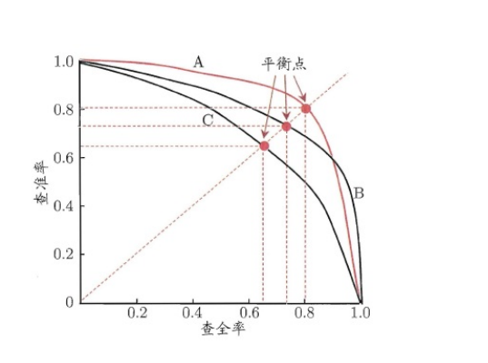

​		P-R曲线评估学习器A的P-R曲线被另一个学习器B的P-R曲线完全包住，则称：B的性能优于A。若A和B的曲线发生了交叉，则谁的曲线下的面积大，谁的性能更优。但是面积很难进行估算，由此衍 生出了“平衡点”（Break-Event Point，简称BEP），即当P=R时的取值，平衡点的取值越高，性能更优。

​		P和R指标有时会出现矛盾的情况，这样就需要综合考虑他们，最常见的方法就是F-Measure，又称F-Score。F-Measure是P和R的加权调和平均，即：
$$
% MathType!MTEF!2!1!+-
% feaagKart1ev2aaatCvAUfeBSjuyZL2yd9gzLbvyNv2CaerbuLwBLn
% hiov2DGi1BTfMBaeXatLxBI9gBaerbd9wDYLwzYbItLDharqqtubsr
% 4rNCHbWexLMBbXgBd9gzLbvyNv2CaeHbl7mZLdGeaGqiVu0Je9sqqr
% pepC0xbbL8F4rqqrFfpeea0xe9Lq-Jc9vqaqpepm0xbba9pwe9Q8fs
% 0-yqaqpepae9pg0FirpepeKkFr0xfr-xfr-xb9adbaqaaeGaciGaai
% aabeqaamaabaabauaakqaabeqaamaalaaabaGaaGymaaqaaiaadAea
% daWgaaWcbaGaeqOSdigabeaaaaGccqGH9aqpdaWcaaqaaiaaigdaae
% aacaaIXaGaey4kaSIaeqOSdi2aaWbaaSqabeaacaaIYaaaaaaakiab
% gwSixpaabmaabaWaaSaaaeaacaaIXaaabaGaamiuaaaacqGHRaWkda
% Wcaaqaaiabek7aInaaCaaaleqabaGaaGOmaaaaaOqaaiaadkfaaaaa
% caGLOaGaayzkaaaabaGaamOramaaBaaaleaacqaHYoGyaeqaaOGaey
% ypa0ZaaSaaaeaadaqadaqaaiaaigdacaqGRaGaeqOSdi2aaWbaaSqa
% beaacaaIYaaaaaGccaGLOaGaayzkaaGaey41aqRaamiuaiabgEna0k
% aadkfaaeaadaqadaqaaiabek7aInaaCaaaleqabaGaaGOmaaaakiab
% gEna0kaadcfaaiaawIcacaGLPaaacqGHRaWkcaWGsbaaaaaaaa!6A41!
\begin{array}{l}
\frac{1}{{{F_\beta }}} = \frac{1}{{1 + {\beta ^2}}} \cdot \left( {\frac{1}{P} + \frac{{{\beta ^2}}}{R}} \right)\\
{F_\beta } = \frac{{\left( {1{\rm{ + }}{\beta ^2}} \right) \times P \times R}}{{\left( {{\beta ^2} \times P} \right) + R}}
\end{array}
$$
​		特：当β=1时，也就是常见的F1度量，是P和R的调和平均，当F1较高时，模型的性能越好。
$$
% MathType!MTEF!2!1!+-
% feaagKart1ev2aaatCvAUfeBSjuyZL2yd9gzLbvyNv2CaerbuLwBLn
% hiov2DGi1BTfMBaeXatLxBI9gBaerbd9wDYLwzYbItLDharqqtubsr
% 4rNCHbWexLMBbXgBd9gzLbvyNv2CaeHbl7mZLdGeaGqiVu0Je9sqqr
% pepC0xbbL8F4rqqrFfpeea0xe9Lq-Jc9vqaqpepm0xbba9pwe9Q8fs
% 0-yqaqpepae9pg0FirpepeKkFr0xfr-xfr-xb9adbaqaaeGaciGaai
% aabeqaamaabaabauaakqaabeqaamaalaaabaGaaGymaaqaaiaadAea
% daWgaaWcbaGaaGymaaqabaaaaOGaeyypa0ZaaSaaaeaacaaIXaaaba
% GaaGOmaaaacqGHflY1daqadaqaamaalaaabaGaaGymaaqaaiaadcfa
% aaGaey4kaSYaaSaaaeaacaaIXaaabaGaamOuaaaaaiaawIcacaGLPa
% aaaeaacaWGgbWaaSbaaSqaaiaaigdaaeqaaOGaeyypa0ZaaSaaaeaa
% caaIYaGaey41aqRaamiuaiabgEna0kaadkfaaeaacaWGqbGaey4kaS
% IaamOuaaaacqGH9aqpdaWcaaqaaiaaikdacqGHxdaTcaWGubGaamiu
% aaqaaiaam2eacaaJobGaae4kaiaadsfacaWGqbGaeyOeI0Iaamivai
% aad6eaaaaaaaa!646C!
\begin{array}{l}
\frac{1}{{{F_1}}} = \frac{1}{2} \cdot \left( {\frac{1}{P} + \frac{1}{R}} \right)\\
{F_1} = \frac{{2 \times P \times R}}{{P + R}} = \frac{{2 \times TP}}{{样本总数{\rm{ + }}TP - TN}}
\end{array}\
$$
有时候我们会有多个二分类混淆矩阵，例如：多次训练或者在多个数据集上训练，那么估算全局性能的方法有两种， 分为宏观和微观。简单理解，宏观就是先算出每个混淆矩阵的P值和R值，然后取得平均P值macro-P和平均R值 macro-R，在算出F<sub>β</sub>或F<sub>1</sub>，而微观则是计算出混淆矩阵的平均TP、FP、TN、FN，接着进行计算P、R，进而求出F<sub>β</sub>或F<sub>1</sub>。
$$
\ \begin{gathered}
  {\text{macro - P = }}\frac{1}{n}\sum\limits_{i = 1}^n {{P_i}} , \hfill \\
  {\text{macro - R = }}\frac{1}{n}\sum\limits_{i = 1}^n {{R_i}} , \hfill \\
  {\text{macro - }}{{\text{F}}_1} = \frac{{2 \times {\text{macro - P}} \times {\text{macro - R}}}}{{{\text{macro - P + macro - R}}}}. \hfill \\
  {\text{micro - P}} = \frac{{\overline {TP} }}{{\overline {TP}  + \overline {FP} }}, \hfill \\
  {\text{micro - R = }}\frac{{\overline {TP} }}{{\overline {TP}  + \overline {FN} }}, \hfill \\
  {\text{micro - }}{{\text{F}}_1} = \frac{{2 \times {\text{micro - P}} \times {\text{micro - R}}}}{{{\text{micro - P + micro - R}}}}. \hfill \\ 
\end{gathered} \
$$


#### 5.3 ROC与AUC 

​		学习器对测试样本的评估结果一般为一个实值或概率，设定一个阈值，大于阈值为正例，小于阈值为负例，因此这个实值的好坏直接决定了学习器的泛化性能，若将这些实值排序，则排序的好坏决定了学习器的性能高低。ROC曲线正是从这个角度出发来研究学习器的泛化性能，ROC曲线与P-R曲线十分类似，都是按照排序的顺序逐一 按照正例预测，不同的是ROC曲线以“真正例率”（True Positive Rate，简称TPR）为横轴，以“假正例率”（False Positive Rate，简称FPR）为纵轴，ROC偏重研究基于测试样本评估值的排序好坏。
$$
\begin{gathered}
  TPR = \frac{{TP}}{{TP + FN}}, \hfill \\
  FPR = \frac{{FP}}{{TN + FP}}. \hfill \\ 
\end{gathered} \
$$
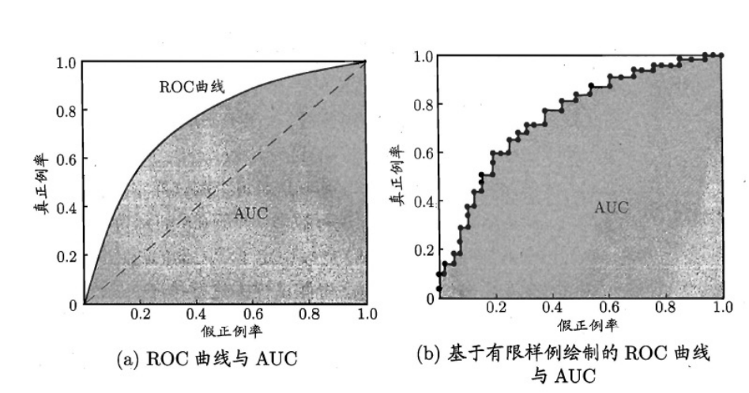

​		简单分析图像，可以得知：当FN=0时，TN也必须0，反之也成立，我们可以画一个队列，试着使用不同的截断点（即阈值）去分割队列，来分析曲线的形状，（0,0）表示将所有的样本预测为负例，（1,1）则表示将所有的样本预测为正例，（0,1）表示正例全部出现在负例之前的理想情况，（1,0）则表示负例全部出现在正例之前的最差情况。

​		现实中的任务通常都是有限个测试样本，因此只能绘制出近似ROC曲线。绘制方法：首先根据测试样本的评估值对测试样本排序，接着按照以下规则进行绘制。

​		绘制出如图(b)所示的近似ROC曲线。绘图过程很简单：给定m<sup>+</sup>个正例和m<sup>-</sup>个反例，根据学习器预测结果对样例进行排序,然后把分类阈值设为最大，即把所有样例均预测为反例，此时真正例率和假正例率均为0,在坐标(0,0)标记一个点。然后，将分类阈值依次设为每个样例的预测值，即依次将每个样例划分为正例。设前一个标记点坐标为(x, y)，当前若为真正例，则对应标记点的坐标为(x,y+$\frac{1}{m^+}$)；当前若为假正例,则对应标记点的坐标为(x+$$ \frac{1}{m^-}$$ ,y)，然后用线段连接相邻点即得.。

​		同样地，进行模型的性能比较时，若一个学习器A的ROC曲线被另一个学习器B的ROC曲线完全包住，则称B的性能优于 A。若A和B的曲线发生了交叉，则谁的曲线下的面积大，谁的性能更优。ROC曲线下的面积定义为AUC（Area Under ROC Curve），不同于P-R的是，这里的AUC是可估算的，即AOC曲线下每一个小矩形的面积之和。易知：AUC越大， 证明排序的质量越好，AUC为1时，证明所有正例排在了负例的前面，AUC为0时，所有的负例排在了正例的前面。
$$
\ AUC = \frac{1}{2}\sum\limits_{i = 1}^{m - 1} {\left( {{x_{i + 1}} - {x_i}} \right) \cdot \left( {{y_i} + {y_{i + 1}}} \right)} \
$$

#### 5.4 代价敏感错误率与代价曲线

​		将学习器的犯错同等对待，但在现实生活中，将正例预测成假例与将假例预测成正例的代价常常是不一样的，二者带来后果不一样。例如：将无疾病—>有疾病只是增多了检查，但有疾病—>无疾病却是增加了生命危险。以二分类为例，由此引 入了“代价矩阵”（cost matrix）。

<table>
	<tr align = "center">
		<td  rowspan = "2"> 真实类别 </td>
		<td  colspan = "2"> 预测类别 </td>
	</tr>
	<tr align = "center">
        		<td> 第0类 </td>
				<td> 第1类 </td>
	</tr>
    	<tr align = "center">
	    <td >第0类</td>
	    <td >0</td>
            <td >cost<sub>01</sub></td>
	</tr>
    	<tr align = "center">
	    <td >第1类</td>
	    <td >cost<sub>10</sub></td>
	    <td >0</td>
	</tr>
</table>

​		在非均等错误代价下，我们希望的是最小化“总体代价”，这样“代价敏感”的错误率为:
$$
\ E(f;D;\cos t) = \frac{1}{m}\left( {\sum\limits_{{x_i} \in {D^ + }}^{} {II(f({x_i}) \ne {y_i}) \times cos{t_{01}}}  + \sum\limits_{{x_i} \in {D^ - }}^{} {II(f({x_i}) \ne {y_i}) \times cos{t_{10}}} } \right)\
$$
​		同样对于ROC曲线，在非均等错误代价下，演变成了“代价曲线”，代价曲线横轴是取值在[0,1]之间的正例概率代价，式中p表示正例的概率，纵轴是取值为[0,1]的归一化代价。
$$
\ \begin{aligned}
& P\left(  +  \right)\operatorname{cost}  = \frac{{p \times {{\operatorname{cost} }_{01}}}}{{p \times {{\operatorname{cost} }_{01}} + \left( {1 - p} \right) \times {{\operatorname{cost} }_{10}}}}, \hfill \\
&  {\operatorname{cost} _{norm}} = \frac{{FNR \times p \times {{\operatorname{cost} }_{01}} + FPR \times \left( {1 - p} \right) \times {{\operatorname{cost} }_{10}}}}{{p \times {{\operatorname{cost} }_{01}} + \left( {1 - p} \right) \times {{\operatorname{cost} }_{10}}}}. \hfill \\ 
\end{aligned} \
$$
​		代价曲线的绘制很简单：设ROC曲线上一点的坐标为(TPR，FPR) ，则可相应计算出FNR，然后在代价平面上绘制一 条从(0，FPR) 到(1，FNR) 的线段，线段下的面积即表示了该条件下的期望总体代价；如此将ROC 曲线土的每个点 转化为代价平面上的一条线段，然后取所有线段的下界，围成的面积即为在所有条件下学习器的期望总体代价，如图 所示：

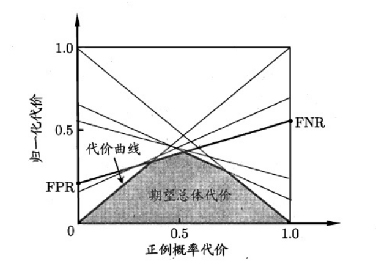


### 6、比较验证

​		在比较学习器泛化性能的过程中，统计假设检验（hypothesis test）为学习器性能比较提供了重要依据，即若A在 某测试集上的性能优于B，那A学习器比B好的把握有多大。 为方便论述，本篇中都是以“错误率”作为性能度量的标准。

#### 6.1 假设验证

​		“假设”指的是对样本总体的分布或已知分布中某个参数值的一种猜想，例如：假设总体服从泊松分布，或假设正态总体的期望u=u<sub>0</sub>。回到本篇中，我们可以通过测试获得测试错误率，但直观上测试错误率和泛化错误率相差不会太远， 因此可以通过测试错误率来推测泛化错误率的分布，这就是一种假设检验。

​		泛化错误率为的学习器在一一个样本上犯错的概率是$$\varepsilon  $$;测试错误率 $ \hat \varepsilon  $意味着在m个测试样本中恰有 $$ \hat \varepsilon \times m$$  个被误分类.假定测试样本是从样本总体分布中独立采样而得，那么泛化错误率为$\varepsilon $的学习器将其中$$m'$$个样本误分类、其余样本全都分类正确的概率是$  \varepsilon ^{m'}{\left( {1 - \varepsilon } \right)^{m-\hat \varepsilon  \times m}}$；由此可估算出其恰将 $ \hat \varepsilon \times m$个样本误分类的概率如下式所示，这也表达了在包含m个样本的测试集上,泛化错误率为$\varepsilon $的学习器被测得测试错误率为$\hat \varepsilon$​的概率:
$$
\ P\left( {\hat \varepsilon ;\varepsilon } \right) = \left( {\begin{array}{*{20}{c}}
  m \\ 
  {\hat \varepsilon  \times m} 
\end{array}} \right){\varepsilon ^{\hat \varepsilon  \times m}}{\left( {1 - \varepsilon } \right)^{m - \hat \varepsilon  \times m}}\
$$
从上式可以看出，当给定泛化错误率后，测试错误率与样本数的乘积(即测试错误数)就是一个典型
的二项分布。因此这里使用二项检验的方法(Binomial Test)， 现假设"$H_0:\varepsilon \leqslant \varepsilon_0,H_1:\varepsilon  > \varepsilon_0 $"，即右边检验，因此我们需要讨论单边检验的拒绝域形式，当$H_1$为真时，测试错误率往往偏大所以拒绝域的形式为$ \hat \varepsilon  \geqslant  k$​，k为某一正常数。
$$
\ \;{P_{\varepsilon  \in {H_0}}}\left\{ {\hat \varepsilon  \geqslant k} \right\} = \sum\limits_{i = mk}^m {\left( {\begin{array}{*{20}{c}}
  m \\ 
  i 
\\\end{array}} \right){\varepsilon ^i}{{\left( {1 - \varepsilon } \right)}^{m - i}}}  \leqslant \sum\limits_{i = mk}^m {\left( {\begin{array}{*{20}{c}}
  m \\ 
  i 
\end{array}} \right){\varepsilon _0}^i{{\left( {1 - {\varepsilon _0}} \right)}^{m - i}}}  \leqslant \partial \
$$
​		一般来说，a通常取值为0.01 ,0.05或0.1,通过该等式从而可以求出满足条件的k值，即临界点，进一步求出该假设检验的拒绝域，当测试错误率大于该临界点时，假设被拒绝。
​		●在假设检验中，我们称$\alpha $为显著性水平，也称显著度(significance) 。
​		●称(1-$\alpha $)为置信度(confidence) 。
​		在很多时候，我们会进行多次重复训练，会得到多个测试错误率，假设有k个。这时我们可
以使用“t检验”，实际上k个测试错误率可以看为泛化错误率的k次独立采样，因此可以算出
这k的样本的均值$\overline X $与方差$S^2$。
$$
\ \bar X = \frac{1}{k}\sum\limits_{i = 1}^k {\hat \varepsilon }\       ,        \      \  {\kern 1pt} \;{S^2} = \frac{1}{{k - 1}}\sum\limits_{i = 1}^k {\left( {\hat \varepsilon  - \bar X} \right)} \
$$
根据中心极限定理的经典推论，可以得知:$\frac{{\left( {\bar X - \varepsilon } \right)}}{{S/\sqrt n }} \sim t\left( {n - 1} \right)$，当n足够大时， t分布近似于N(0, 1)分布，一般情况下在n>45时，就可以使用标准正态分布的上分为点的a值，有了这个分布之后，我们就可以类似二项检验进行t假设检验。t分布的示意图以及常用双边临界值表如下所示:

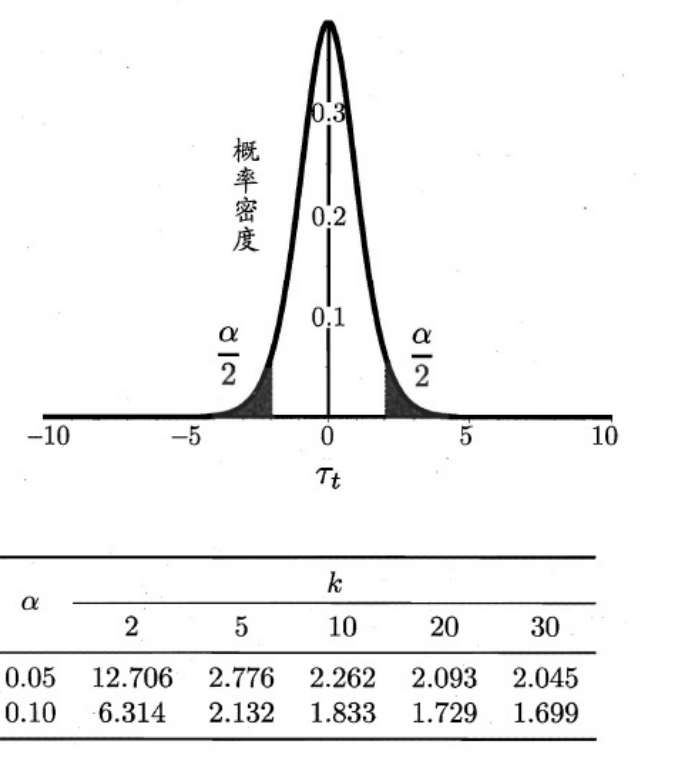

#### 6.2 交叉验证t检验

​		若想比较两个学习器A和B的泛化性能,则使用"成对t检验”( paired t-tests )进行比较检验。基本思想是:当对两个学习器进行k折交叉验证时,在相同的一组训练/测试集上,学习A/B会产生一对测试错误率$\hat \varepsilon _A /\hat \varepsilon _B $,若两个学习器性能相同，则$\hat \varepsilon _A  = \hat \varepsilon _B$。我们对每一组测试错误率求差值，$\Delta \ =\hat \varepsilon _A  - \hat \varepsilon _B$ ,则可以得到k个差值,这个k个差值可以看作学习器A和学习器B性能差值的独立采样,因此有:
$$
\frac{\left| {\left( {\overline \Delta   - \left( {{\varepsilon _A} - {\varepsilon _B}} \right)} \right)} \right|}{S/\sqrt k } \sim t\left( {k - 1} \right)
$$
​		若假设$H_0:\hat \varepsilon _A  = \hat \varepsilon _B，H_1:\hat \varepsilon _A   \ne \hat \varepsilon _B，$则需满足$\frac {\left| { {\overline \Delta  } } \right|}{{S/\sqrt k }} \leqslant t_{\partial / 2}$，从而求出临界点与拒绝域。在”成对检验”的基本思想中,我们的前提是测试错误率是泛化错误率的独立采样,但是在k折交叉检验中,选择的训练/测试集难免会产生重叠,因此好的解决办法是使用5次2折交叉验证,使用第一次的两对差值计算均值,使用全部的差值对(即10对)计算方差，可以有效地避免这个问题。

#### 6.3 McNemar 检验

​		MaNemar主要用于二分类问题，与成对t检验一样也是用于比较两个学习器的性能大小。主要思想是：若两学习器的性 能相同，则A预测正确B预测错误数应等于B预测错误A预测正确数，即$e_{01}=e_{10}$，且$\left|  e_{01}-e_{10}  \right|$服从N（1， $e_{01}+e_{10}$）分布。

<table>
	<tr align = "center">
		<td  rowspan = "2"> 算法B </td>
		<td  colspan = "2"> 算法A </td>
	</tr>
	<tr align = "center">
        		<td> 正确 </td>
				<td> 错误 </td>
	</tr>
    	<tr align = "center">
	    <td >正确</td>
            <td >e<sub>00</sub></td>
            <td >e<sub>01</sub></td>
	</tr>
    	<tr align = "center">
	    <td >错误</td>
	    <td >e<sub>10</sub></td>
	    <td >e<sub>11</sub></td>
	</tr>
</table>

​		因此，如下所示的变量服从自由度为1的卡方分布，即服从标准正态分布N（0,1）的随机变量的平方和，下式只有一 个变量，故自由度为1，检验的方法同上：做出假设—>求出满足显著度的临界点—>给出拒绝域—>验证假设。
$$
{\tau _{{\chi ^2}}} = \frac{{{{\left( {\left| {{e_{01}} - {e_{10}}} \right| - 1} \right)}^2}}}{{{e_{01}} + {e_{10}}}}
$$

#### 6.4 Friedman检验与Nemenyi后续检验

​		以上的三种检验都只能在一组数据集上，F检验则可以在多组数据集进行多个学习器性能的比较，基本思想是在同一组数据集上，根据测试结果（例：测试错误率）对学习器的性能进行排序，赋予序值1,2,3…，相同则平分序值，如下图 所示：

<table>
	<tr align = "center">
		<td  > 数据集 </td>
		<td  > 算法A </td>
        <td >算法B</td>
        <td >算法C</td>
	<tr align = "center">
        <td> D<sub>1</sub> </td>
				<td> 1 </td>
        <td >2</td>
        <td >3</td>
	</tr>
    	<tr align = "center">
	    <td >D<sub>2</sub></td>
	    <td >1</td>
	    <td >2.5</td>
            <td >2.5</td>
	</tr>
    	<tr align = "center">
	    <td >D<sub>3</sub></td>
	    <td >1</td>
	    <td >2</td>
            <td >3</td>
    </tr>
    	<tr align = "center">
	    <td >D<sub>4</sub></td>
	    <td >1</td>
	    <td >2</td>
            <td >3</td>
	</tr>
        </tr>
    	<tr align = "center">
            <td >平均序值</td>
	    <td >1</td>
	    <td >2.125</td>
            <td >2.875</td>
	</tr>
</table>

​		若学习器的性能相同，则它们的平均序值应该相同，且第$i$个算法的平均序值$r_i$服从正态分布N$( (k+1)/2,(k+1)(k-1)/{12})$，则有：
$$
\begin{gathered}
  {\tau _{{\chi ^2}}} = \frac{{k - 1}}{k} \cdot \frac{{12N}}{{{k^2} - 1}}\sum\limits_{i = 1}^k {{{\left( {{r_i} - \frac{{k + 1}}{2}} \right)}^2}}  \hfill \\ \quad  = \frac{{12N}}{{k\left( {k - 1} \right)}}\left( {\sum\limits_{i = 1}^k {r_i^2 - \frac{{k{{\left( {k + 4} \right)}^2}}}{4}} } \right) \hfill \\ 
\end{gathered}
$$
​		在$k$和$N$都较大时,服从自由度为$k-1$的$\chi ^2$分布.
$$
\tau _F = \frac{{\left( {N - 1} \right){\tau _{{\chi ^2}}}}}{{N\left( {k - 1} \right) - {\tau _{{\chi ^2}}}}}
$$
​		服从自由度为k-1和(k-1)(N-1)的F分布。下面是F检验常用的临界值：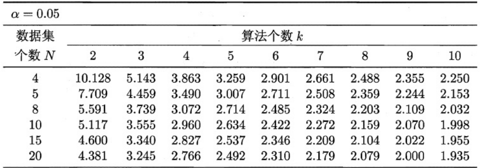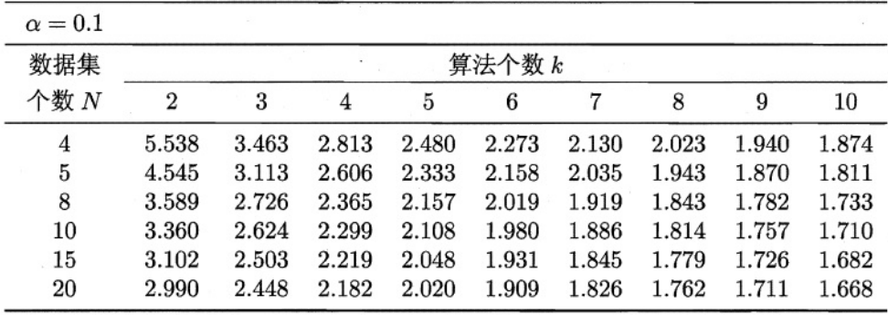

若“H0：所有算法的性能相同”这个假设被拒绝，则需要进行后续检验，来得到具体的算法之间的差异。常用的就是Nemenyi后续检验。Nemenyi检验计算出平均序值差别的临界值域，下表是常用的$q_\alpha $值，若两个算法的平均序值差超出了临界值域CD，则相应的置信度1-$\alpha$拒绝“两个算法性能相同”的假设。
$$
CD = {q_\alpha }\sqrt {\frac{{k\left( {k + 1} \right)}}{{6N}}}
$$
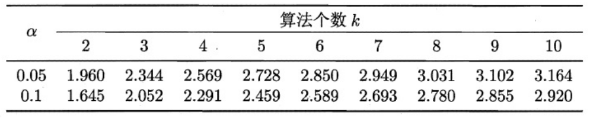

### 7、偏差与方差

​		偏差-方差分解是解释学习器泛化性能的重要工具。在学习算法中，偏差指的是预测的期望值与真实值的偏差，方差则是每一次预测值与预测值得期望之间的差均方。实际上，偏差体现了学习器预测的准确度，而方差体现了学习器预测的稳定性。通过对泛化误差的进行分解，可以得到：

​		$ \bullet $期望泛化误差=方差+偏差

​		$ \bullet $偏差刻画学习器的拟合能力 

​		$ \bullet $方差体现学习器的稳定性

​		易知：方差和偏差具有矛盾性，这就是常说的偏差-方差窘境（bias-variance dilemma），随着训练程度的提升，期望预测值与真实值之间的差异越来越小，即偏差越来越小，但是另一方面，随着训练程度加大，学习算法对据集的波动越来越敏感，方差值越来越大。换句话说：在欠拟合时，偏差主导泛化误差，而训练到一定程度后，偏差越来越小，方差主导了泛化误差。简而言之就是训练要适量，适度辄止。

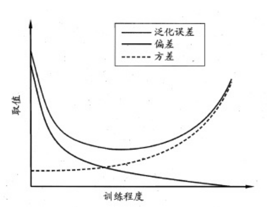

## 三、线性模型

​		看到这个不由想起高中学过的最小二乘法，这就是 线性模型的经典算法之一：根据给定的（x，y）点对，求出一条与这些点拟合效果最好的直线$y=ax+b$，之前我们利用 下面的公式便可以计算出拟合直线的系数a,b（3.1中给出了具体的计算过程），从而对于一个新的x，可以预测它所 对应的y值。
$$
b = \frac{{{x_1}{y_1} + {x_2}{y_2} +  \cdots  + {x_n}{y_n} - n\overline x \overline y }}{{x_1^2 + x_2^2 +  \cdots  + x_n^2 - n{{\overline x }^2}}},a = \overline y  - b\overline {x.} 
$$


### 1、[线性回归 – linear regression](https://easyai.tech/ai-definition/linear-regression/)

[详细代码](LinearRegression)

### 2、线性几率回归

### 3、线性判断分析

### 4、多分类学习

### 5、类别不平衡问题

## 四、决策树

[决策树 – Decision tree](https://easyai.tech/ai-definition/decision-tree/)

### 1、决策树基本概念

​		决策树是基于树结构来进行决策的。

​		有趣又形象的例子：

​		一位捉急的母亲想要给自己的女娃介绍一个男朋友，于是有了下面的对话：

```txt
女儿：多大年纪了？
母亲：26。
女儿：长的帅不帅？
母亲：挺帅的。
女儿：收入高不？
母亲：不算很高，中等情况。
女儿：是公务员不？
母亲：是，在税务局上班呢。
女儿：那好，我去见见。
```

​		女孩的挑剔过程就是一个典型的决策树，通过年龄、长相、收入和是否公务员将男人分为两个类型见和不见。假设这个女孩对男人的要求是：30岁以下、长相中等以上并且是高收入者或中等以上收入的公务员，那么 使用下图就能很好地表示女孩的决策逻辑（即一颗决策树）。

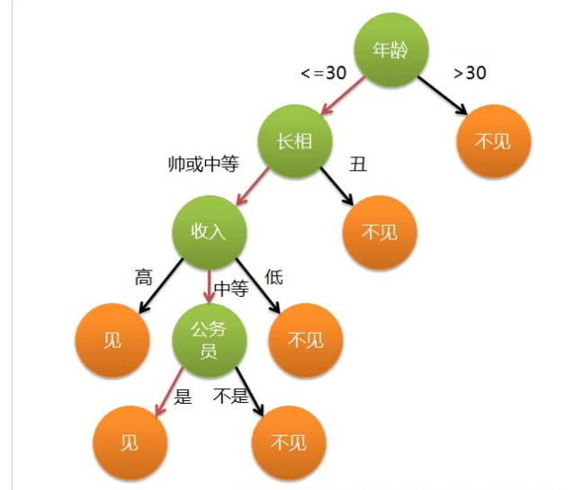

​		上图的决策树中，决策过程的每一次判定都是对某一属性的“测试”，决策最终结论则对应最终的判定结果。一般一 颗决策树包含：一个根节点、若干个内部节点和若干个叶子节点，易知：

1. 每个非叶节点表示一个特征属性测试。 
2. 每个分支代表这个特征属性在某个值域上的输出。
3. 每个叶子节点存放一个类别。
4. 每个节点包含的样本集合通过属性测试被划分到子节点中，根节点包含样本全集。

### 2、决策树的构造

​		决策树的构造是一个递归的过程，有三种情形会导致递归返回：

* 当前结点包含的样本全属于同一类别，这时直接 将该节点标记 为叶节点，并设为相应的类别；

* 当前属性集为空，或是所有样本在所有属性上取值相同，无法划分，这时将该节点标记为叶节点，并将其类别设为该节点所含样本最多的类别；

* 当前结点包含的样本集合为空， 不能划分，这时也将该节点标记为叶节点，并将其类别设为父节点中所含样本最多的类别。

​		决策树算法的基本流程如下图所示：

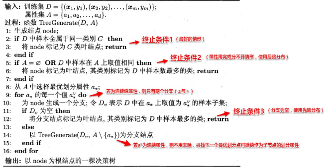

[代码](决策树)与[要求](https://blog.csdn.net/qq_43605229/article/details/116462410)及[注意](https://blog.csdn.net/suhao0911/article/details/110950742)

​		决策树学习的关键在于选择划分属性，不同的划分属性得出不同的分支结构，从而影响整颗决策树的性能。属性划分的目标是让各个划分出来的子节点尽可能“纯”，即属于同一类别。因此下面便是介绍量化纯度的具体方法，决策树最常用的算法有三种：ID3，C4.5和CART。

#### 2.1 ID3算法

​		本算法使用信息增益为准则来选择划分属性，“信息熵”(information entropy)是度量样本结合纯度的常用指 标.假定当前样本集合D中第k类样本所占比例为$p_k$，则样本集合D的信息熵定义为：
$$
\ Ent\left( D \right) =  - \sum\limits_{k = 1}^{\left| y \right|} {{p_k}{{\log }_2}{p_k}} .\\ 值越大表示越混乱，易知只有一个类别时，信息熵为0
$$
​		假定通过属性划分样本集D，产生了V个分支节点，v表示其中第v个分支节点，易知：分支节点包含的样本数越多，表 示该分支节点的影响力越大。故可以计算出划分后相比原始数据集D获得的“信息增益”（information gain）。
$$
Gain\left( {D,a} \right) = Ent\left( D \right) - \sum\limits_{v = 1}^V {\frac{{\left| {{D^v}} \right|}}{{\left| D \right|}}Ent\left( {{D^v}} \right)} .
$$
​		信息增益越大，表示使用该属性划分样本集D的效果越好，因此ID3算法在递归过程中，每次选择最大信息增益的属性 作为当前的划分属性。

​		但是这个方法存在一个问题，就是偏向于取值数目较多的属性，例如：如果存在一个唯一标识，这样样本集D将会被划分 为$|D|$个分支，每个分支只有一个样本，这样划分后的信息熵为零，十分纯净，但是对分类毫无用处。

#### 2.2 C4.5算法

​		C4.5算法 使用了“增益率”（gain ratio）来选择划分属性，来避免ID3算法问题带来的困扰。首先使用ID3算法计算出信息增益高于平均水平的候选属性，接着C4.5计算这些候选属性的增益率，增益率定义为：
$$
\ Gain\_ratio\left( {D,A} \right) = \frac{{Gain\left( {D,a} \right)}}{{IV\left( {a} \right)\ }},\
$$
其中
$$
\ IV\left( a \right) = \sum\limits_{v = 1}^V {\frac{{\left| {{D^v}} \right|}}{{\left| D \right|}}{{\log }_2}\frac{{\left| {{D^v}} \right|}}{{\left| D \right|}}.} \
$$

#### 2.3 CART算法

​		CART决策树使用“==基尼指数==”（Gini index）来选择划分属性，基尼指数反映的是从样本集D中随机抽取两个样本， 其类别标记不一致的概率，因此Gini(D)越小越好，基尼指数定义如下：
$$
\begin{gathered}
  Gini\left( D \right) = \sum\limits_{k = 1}^{\left| y \right|} {\sum\limits_{k' \ne 1} {{p_k}{p_{k'}}} }  \hfill  \\
  {\kern 1pt} \quad \quad \quad \;\; = 1 - \sum\limits_{k = 1}^{\left| y \right|} {p_k^2} . \hfill \\ 
 任取两个样本类标不一致的概率越小表示集合越纯
\end{gathered}
$$
​		进而，使用属性$α$划分后的基尼指数为：
$$
\ Gini\_index\left( {D,a} \right) = \sum\limits_{v = 1}^V {\frac{{\left| {{D^v}} \right|}}{{\left| D \right|}}Gini\left( {{D^v}} \right)} \\
故选择基尼指数最小的划分属性
$$

### 3、剪枝处理

​		从决策树的构造流程中我们可以直观地看出：不管怎么样的训练集，决策树总是能很好地将各个类别分离开来，这时 就会遇到之前提到过的问题：过拟合（overfitting），即太依赖于训练样本。剪枝（pruning）则是决策树算法对 付过拟合的主要手段，剪枝的策略有两种如下：

* 预剪枝（prepruning）：在构造的过程中先评估，再考虑是否分支。

* 后剪枝（post-pruning）：在构造好一颗完整的决策树后，自底向上，评估分支的必要性。

​		评估指的是性能度量，即决策树的泛化性能。预剪枝表示在构造数的过程中，对一个节点考虑是否分支时，首先计算决策树不分支时 在测试集上的性能，再计算分支之后的性能，若分支对性能没有提升，则选择不分支（即剪枝）。后剪枝则表示在构 造好一颗完整的决策树后，从最下面的节点开始，考虑该节点分支对模型的性能是否有提升，若无则剪枝，即将该节点标记为叶子节点，类别标记为其包含样本最多的类别。

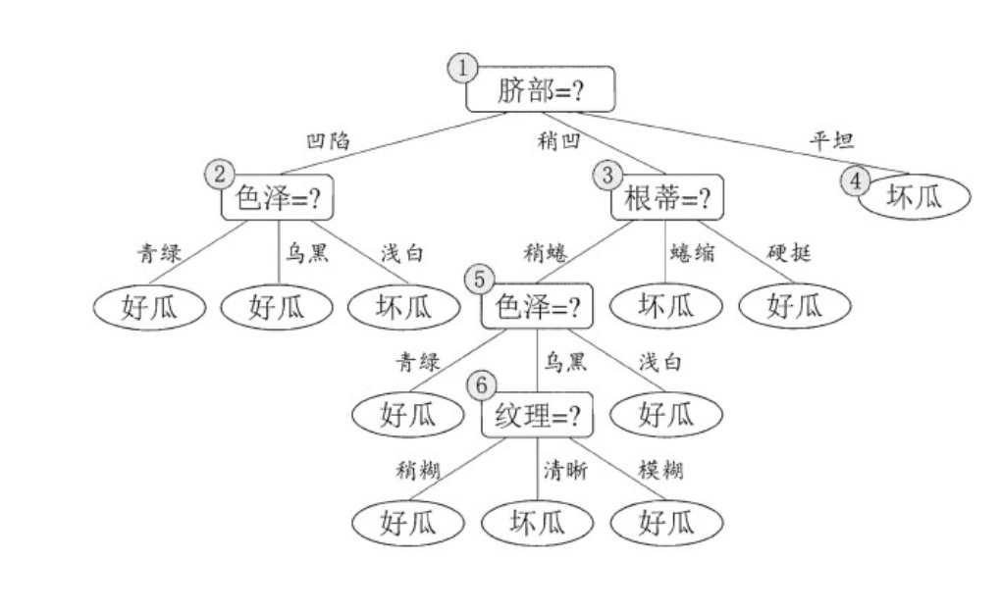

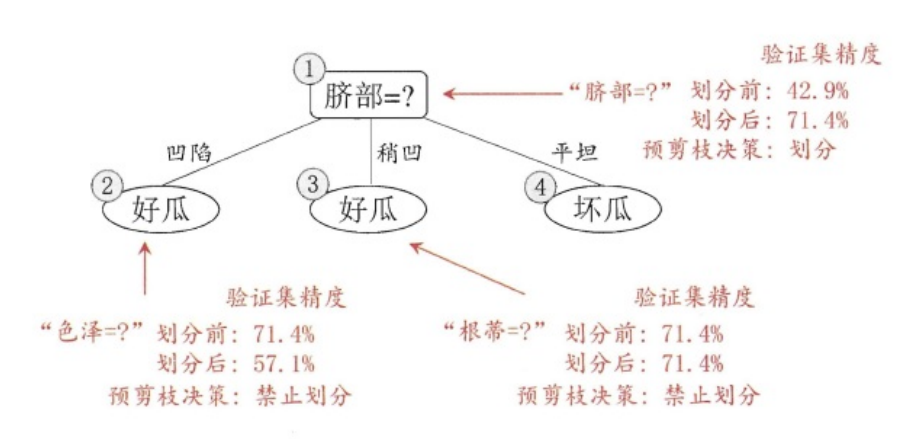

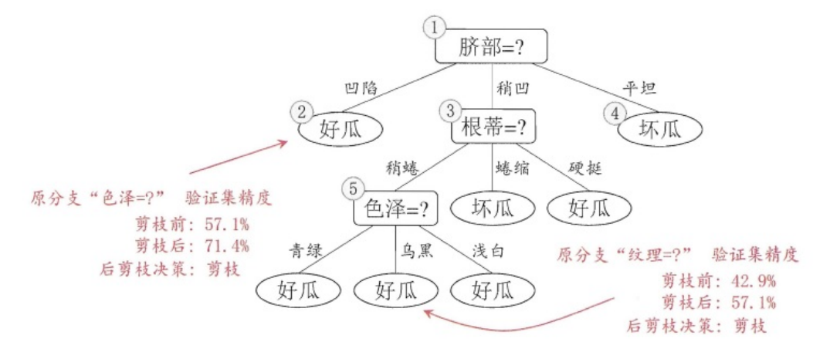

​		上图分别表示不剪枝处理的决策树、预剪枝决策树和后剪枝决策树。预剪枝处理使得决策树的很多分支被剪掉，因此 大大降低了训练时间开销，同时降低了过拟合的风险，但另一方面由于剪枝同时剪掉了当前节点后续子节点的分支， 因此预剪枝“贪心”的本质阻止了分支的展开，在一定程度上带来了欠拟合的风险。而后剪枝则通常保留了更多的分 支，因此采用后剪枝策略的决策树性能往往优于预剪枝，但其自底向上遍历了所有节点，并计算性能，训练时间开销相比预剪枝大大提升，可以说是各有优劣。


### 4、连续值与缺失值处理

​		对于连续值的属性，若每个取值作为一个分支则显得不可行，因此需要进行离散化处理，常用的方法为二分法，基本思想为：给定样本集D与连续属性$α$，二分法试图找到一个划分点t将样本集D在属性$α$上分为≤t与＞t。

* 首先将$α$的所有取值按升序排列，所有相邻属性的均值作为候选划分点（$n-1$个，$n$为$α$所有的取值数目）。

* 计算每一个划分点划分集合D（即划分为两个分支）后的信息增益。 
* 选择最大信息增益的划分点作为最优划分点。

$$
\begin{gathered}
划分为两枝\\
  Gain\left( {D,a} \right) = {\max _{t \in {T_a}}}Gain\left( {D,a,t} \right) \hfill \\
  \quad \quad \quad \quad \quad \quad \quad \quad \quad \quad \quad \quad  \;\;{\kern 12pt}  = {\max _{t \in {T_a}}}Ent\left( D \right) - \sum\limits_{\lambda  \in \left\{ { - , + } \right\}} {\frac{{\left| {D_t^\lambda } \right|}}{{\left| D \right|}}Ent\left( {D_t^\lambda } \right)} . \hfill \\ 
\end{gathered}
$$

​		现实中常会遇到不完整的样本，即某些属性值缺失。有时若简单采取剔除，则会造成大量的信息浪费，因此在属性值 缺失的情况下需要解决两个问题：（1）如何选择划分属性。（2）给定划分属性，若某样本在该属性上缺失值，如何 划分到具体的分支上。

​		假定为样本集中的每一个样本都赋予一个权重，根节点中的权重初始化为1，则定义：
$$
\begin{flalign*}
&  \rho  = \frac{{\sum\nolimits_{x \in \widetilde D} {{w_x}} }}{{\sum\nolimits_{x \in D} {{w_x}} }}, \hfill 
\quad \quad \quad 样本子集所占比例\\
&  \widetilde {{p_k}} = \frac{{\sum\nolimits_{x \in {{\widetilde D}_k}} {{w_x}} }}{{\sum\nolimits_{x \in \widetilde D} {{w_x}} }}\quad \left( {1 \leqslant k \leqslant \left| y \right|} \right), \hfill 
\quad \quad \quad 样本子集每个类别的比例\\
 &{\widetilde r_v} = \frac{{\sum\nolimits_{x \in {{\widetilde D}^v}} {{w_x}} }}{{\sum\nolimits_{x \in \widetilde D} {{w_x}} }}\quad \left( {1vV} \right)\quad \left( {1 \leqslant v \leqslant V} \right). \hfill 
 \quad \quad \quad 每个分支所含样本比例比例\\ 
\end{flalign*}
$$
​		对于（1）：通过在样本集D中选取在属性α上没有缺失值的样本子集，计算在该样本子集上的信息增益，最终的信息增 益等于该样本子集划分后信息增益乘以样本子集占样本集的比重。即：
$$
\begin{flalign*}
&  Gain\left( {D,a} \right) = \rho  \times Gain\left( {\widetilde D,a} \right) \hfill
\\
 & \quad \quad \quad \quad \;{\kern 1pt} {\kern 1pt} \; = \rho  \times \left( {Ent\left( {\widetilde D} \right) - \sum\limits_{v = 1}^V {{{\widetilde r}_v}Ent\left( {{{\widetilde D}^v}} \right)} } \right) \hfill \\ 
& Gain\left( {\widetilde D,a} \right) \hfill \quad \quad
表示表示在属性a上无缺失的样本子集\\
&\rho\quad \quad 无缺失样本子集
所店轮量
\end{flalign*}
$$
​		对于（2）：若该样本子集在属性α上的值缺失，则将该样本以不同的权重（即每个分支所含样本比例）划入到所有分 支节点中。该样本在分支节点中的权重变为：
$$
{w_x} = {w_x}*{\widetilde r_v}\quad \quad即以不同权重划分到所有分支节点中
$$


## 五、神经网络

### 1、 神经元模型

### 2、 感知机与多层网络

### 3、 BP神经网络算法

### 4、 全局最小与局部最小

### 5、深度学习

## 六、支持向量机

[支持向量机 – Support Vector Machine | SVM](https://easyai.tech/ai-definition/svm/)

### 1、 函数间隔与几何间隔

### 2、 最大间隔与支持向量

### 3、 从原始优化问题到对偶问题

### 4、 核函数

### 5、 软间隔支持向量机

## 七、贝叶斯分类器

### 1、 贝叶斯决策论

### 2、 极大似然法

### 3、 朴素贝叶斯分类器

## 八、EM算法

### 1、 EM算法思想

### 2、 EM算法数学推导

### 3、 EM算法流程

## 九、集成学习

[集成学习（Ensemble Learning）](https://easyai.tech/ai-definition/ensemble-learning/)

### 1、个体与集成

### 2、 Boosting

### 3、 Bagging与Random Forest

### 4、结合策略

### 5、多样性（diversity）

## 十、聚类算法

​		聚类是一种经典的无监督学习方法，试图将数据集的样本划分为若干个互不相交的类簇， 从而每个簇对应一个潜在的类别。

​		聚类直观上来说是将相似的样本聚在一起，从而形成一个类簇（cluster）。这里我们用距离度量来度量相似性 （similarity measure），而性能度量为评价聚类结果的好坏提供了一系列有效性指标。

### 1、距离度量

​		度量距离还有其它的很多经典方法，通常它们需要满足一些基本性质：直递性就是我们常说的三角不等式：两边之和大于第三边
$$
\begin{flalign*}
&非负性:dist\left( {{x_i},{x_j}} \right) \geqslant 0; \\
&同一性:dist\left( {{x_i},{x_j}} \right) = 0 当且仅当x_i=x_j;\\
&对称性:dist\left( {{x_i},{x_j}} \right)=dist\left( {{x_j},{x_i}} \right);\\
&直递性:dist\left( {{x_i},{x_j}} \right) \leqslant dist\left( {{x_i},{x_k}} \right) + dist\left( {{x_k},{x_j}} \right).
\end{flalign*}
$$
​		最熟悉的距离度量(欧氏距离（Euclidean distance）)，就是闵可夫斯基距离$p=2$：
$$
dis{t_{ed}}\left( {{x_i},{x_j}} \right) = {\left\| {{x_i} - {x_j}} \right\|_2} = \sqrt {\sum\limits_{u = 1}^n {{{\left| {{x_{iu}} - {x_{ju}}} \right|}^2}} } .
$$
​		曼哈顿距离（Manhattan distance），就是闵可夫斯基距离$p=1$:
$$
dis{t_{man}}\left( {{x_i},{x_j}} \right) = {\left\| {{x_i} - {x_j}} \right\|_1} = \sum\limits_{u = 1}^n {\left| {{x_{iu}} - {x_{ju}}} \right|}  .
$$
​		最常用的距离闵可夫斯基距离（Minkowski distance)：
$$
dis{t_{mk}}\left( {{x_i},{x_j}} \right) = {\left( {\sum\limits_{u = 1}^{{n_c}} {{{\left| {{x_{iu}} - {x_{ju}}} \right|}^p}} } \right)^{\frac{1}{p}}}.
$$
​		两种属性：连续属性和离散属性（有限个取值）。

​		对于连续值的属性，一般都可以被学习器所用，有时会根据具体的情形作相应的预处理，例如：归一化等；而对于离散值的属性，需要作下面进一步的处理:

---

​		若属性值之间存在序关系，则可以将其转化为连续值，例如：身高属性“高”“中等”“矮”，可转化为{1, 0.5, 0}。若属性值之间不存在序关系，则通常将 其转化为向量的形式，例如：性别属性“男”“女”，可转化为{(1,0),(0,1)}。

---

​		在进行距离度量时，易知连续属性和存在序关系的离散属性都可以直接参与计算，因为它们都可以反映一种程度，我们称其为“有序属性”；而对于不存在序关系的离散属性，我们称其为：“无序属性”，显然无序属性再使用闵可夫斯基距离就行不通了。

​		对于无序属性，我们一般采用VDM进行距离的计算，例如：对于离散属性的两个取值a和b，$i$表示类簇，定义：
$$
VD{M_p}\left( {a,b} \right) = \sum\limits_{i = 1}^k {\left| {\frac{{{m_{u,a,i}}}}{{{m_{u,a}}}} - \frac{{{m_{u,b,i}}}}{{{m_{u,b}}}}} \right|} .
$$
​		这样处理之后，在计算两个样本之间的距离时，我们可以将闵可夫斯基距离和VDM混合在一起进行计算,(有序属性-无序属性)：
$$
\;MinkovD{M_p}\left( {{x_i},{x_j}} \right) = {\left( {\sum\limits_{u = 1}^{{n_c}} {{{\left| {{x_{iu}} - {x_{ju}}} \right|}^p}}  - \sum\limits_{u = {n_c} + 1}^n {VD{M_p}\left( {{x_{iu}},{x_{ju}}} \right)} } \right)^{\frac{1}{p}}}.
$$
​		若我们定义的距离计算方法是用来度量相似性，例如后面讨论的聚类问题，即距离越小，相似性越大，反之距离越大，相似性越小。这时距离的度量方法并不一定需要满足前面所说的四个基本性质，这样的方法称为：非度量距离 （non-metric distance）。

### 2、性能度量

​		聚类不能像监督学习那般通过计算精确度或错误率评价学习器器的好坏或作为学习过程中的优化目标。一般聚类有两类性能度量指标：外部指标和内部指标。

#### 2.1 外部指标

​		将聚类结果与某个参考模型的结果进行比较，以参考模型的输出作为标准，来评价聚类好坏。假设聚类给出的结果 为$\lambda$，参考模型给出的结果是$\lambda ^*$，则我们将样本进行两两配对，定义：
$$
\begin{flalign*}
 &a = \left| {SS} \right|,SS = \left\{ {\left( {{x_i},{x_j}} \right)\left| {\left. {{\lambda _i} = {\lambda _j},\lambda _i^* = \lambda _j^*,i < j} \right)} \right.} \right\}, 参考结果同类簇，聚类结果同类簇\\
 &b = \left| {SD} \right|,SD = \left\{ {\left( {{x_i},{x_j}} \right)\left| {\left. {{\lambda _i} = {\lambda _j},\lambda _i^* \ne \lambda _j^*,i < j} \right)} \right.} \right\},参考结果不同类簇.聚类结果同类簇\\
 &c = \left| {DS} \right|,DS = \left\{ {\left( {{x_i},{x_j}} \right)\left| {\left. {{\lambda _i} \ne {\lambda _j},\lambda _i^* = \lambda _j^*,i < j} \right)} \right.} \right\},参考结果同类簇，聚类结果不同类簇\\
 &d = \left| {DD} \right|,DD = \left\{ {\left( {{x_i},{x_j}} \right)\left| {\left. {{\lambda _i} \ne {\lambda _j},\lambda _i^* \ne \lambda _j^*,i < j} \right)} \right.} \right\}.参考结果不同类簇,聚类结果不同类簇
\end{flalign*}
$$
​		显然a和d代表着聚类结果好坏的正能量，b和c则表示参考结果和聚类结果相矛盾，基于这四个值可以导出以下常用的 外部评价指标：
$$
\begin{aligned}
&\bullet Jaccard{\kern 2pt} 系数(Jaccard{\kern 4pt}Coefficient ,简称JC)\\
&JC = \frac{{{a}}}{{a + b + c}}\\
&\bullet FM{\kern 2pt} 指数(Fowlkes{\kern 4pt}and{\kern 4pt}Nallows{\kern 4pt}Index ,简称FMI)\\
&FMI = \sqrt {\frac{a}{{a + b}} \cdot \frac{a}{{a + c}}} \\
&\bullet Rand{\kern 2pt} 指数(Rand{\kern 4pt}Index ,简称PI)\\
&RI = \frac{{2\left( {a + d} \right)}}{{m\left( {m - 1} \right)}}
\end{aligned}
$$

#### 2.2 内部指标

​		内部指标即不依赖任何外部模型，直接对聚类的结果进行评估，聚类的目的是想将那些相似的样本尽可能聚在一起， 不相似的样本尽可能分开，直观来说：簇内高内聚紧紧抱团，簇间低耦合老死不相往来，定义：
$$
\begin{flalign*}
 & avg\left( C \right) = \frac{2}{{\left| C \right|\left( {\left| C \right| - 1} \right)}}\sum\nolimits_{1 \leqslant i < j \leqslant \left| C \right|} {dist\left( {{x_i},{x_j}} \right)} , \hfill 簇内平均距离，越小越好\\
&  diam\left( C \right) = {max _{1 \leqslant i < j \leqslant \left| C \right|}}dist\left( {{x_i},{x_j}} \right), \hfill 簇内最大距离，越小越好\\
&  {d_{\min }}\left( {{C_i},{C_j}} \right) = {min _{{x_i} \in {C_i},{x_{j \in {C_j}}}}}dist\left( {{x_i},{x_j}} \right), \hfill 簇间最小距离，越大越好\\
&  {d_{{{cen}}}}\left( {{C_i},{C_j}} \right) = dist\left( {{\mu _i},{\mu _j}} \right), \hfill 簇中心距离，越大越好\\ 
\end{flalign*}
$$
​		基于上面的四个距离，可以导出下面这些常用的内部评价指标：
$$
\begin{aligned}
&\bullet DB{\kern 2pt} 指数(Davies-Bouldin{\kern 4pt}Index ,简称DBI)越小越好\\
&DBI = \frac{1}{k}\sum\limits_{i = 1}^k {{\mathop {\max }\limits_{j \ne i} }\left( {\frac{{avg\left( {{C_i}} \right) + avg\left( {{C_j}} \right)}}{{{d_{cen}}\left( {{\mu _i},{\mu _j}} \right)}}} \right)} .\\
&\bullet Dunn{\kern 2pt} 指数(Dunn{\kern 4pt}Index ,简称DI)越大越好\\
&DI = {\min _{1 \leqslant i \leqslant k}}\left\{ {{\mathop {\min }\limits_{j \ne i} }\left\{ {\frac{{{d_{\min }}\left( {{C_i},{C_j}} \right)}}{{{{\max }_{1 \leqslant i \leqslant k}}diam\left( {{C_i}} \right)}}} \right\}} \right\}.
\end{aligned}
$$

### 3、原型聚类

​		原型聚类即“基于原型的聚类”（prototype-based clustering），原型表示模板的意思，就是通过参考一个模板向量或模板分布的方式来完成聚类的过程，常见的K-Means便是基于簇中心来实现聚类，混合高斯聚类则是基于簇分布来实现聚类。

#### 3.1 [K-Means（k-means clustering)](https://easyai.tech/ai-definition/k-means-clustering/)

​		有趣的网站：[可视化 K 均值聚类 (naftaliharris.com)](https://www.naftaliharris.com/blog/visualizing-k-means-clustering/)

​		在我看来，就是先定点个数，再随机找点，再不断迭代计算，不断移动点位置，直至找到对应真正的类中心。	

​		首先随机定中心，根据样本与类中心的远近划分类簇，接着重新计算类中心，不断迭代直至收敛。但是其中迭代的过程并不是主观地想象得出，事实上，若将样本的类别看做为“隐变量”（latent variable），类中心看作样本的分布参数，这一过程正是通过EM算法的两步走策略而计算出，其根本的目的是为了最小化平方误差函数E：
$$
\begin{aligned}
E = \sum\limits_{i = 1}^k {\sum\limits_{x \in {C_i}} {\left\| {x - {\mu _i}} \right\|_2^2} } ,
\end {aligned}
$$
​		K-Means的算法流程如下所示：

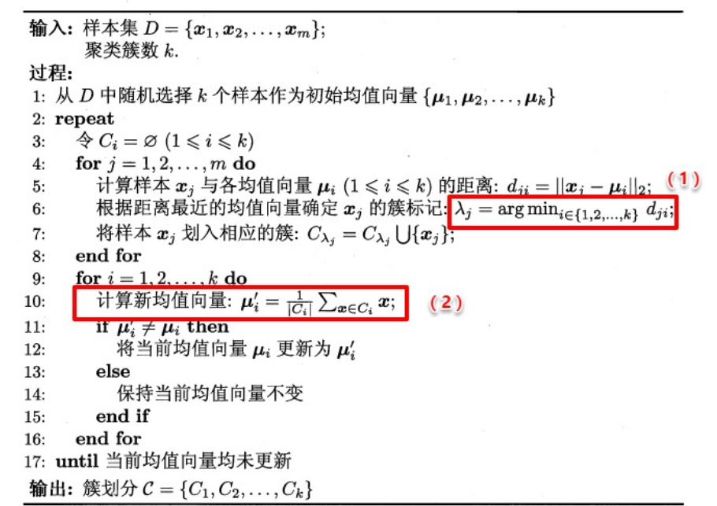

[详细代码](KMeans)	

#### 3.2 学习向量量化(LQV)

​		LVQ使用样本真实类标记辅助聚类,首先LVQ根据样本的类标 记，从各类中分别随机选出一个样本作为该类簇的原型，从而组成了一个原型特征向量组，接着从样本集中随机挑选 一个样本，计算其与原型向量组中每个向量的距离，并选取距离最小的原型向量所在的类簇作为它的划分结果，再与真实类标比较。若划分结果正确，则对应原型向量向这个样本靠近一些若划分结果不正确，则对应原型向量向这个样本远离一些。

​		LVQ算法的流程如下所示：

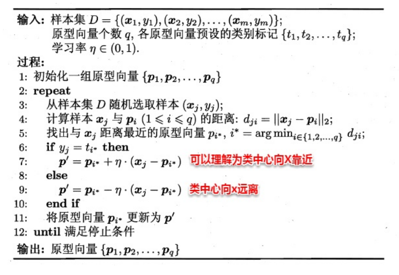

导入需要的库：

```
import pandas as pd
import numpy as np
import random
```

 读取数据，并将三种不同标签数据分类：

```
data = pd.read_csv('iris.data', header = None)

data_setosa = data[data[4]=='Iris-setosa']
data_versicolor = data[data[4]=='Iris-versicolor']
data_virginica = data[data[4]=='Iris-virginica']
```

 根据行索引，随机选择三个数据作为初始原型向量

```
a = data_setosa.index
b = data_versicolor.index
c = data_virginica.index

i = random.sample(list(a), 1)
j = random.sample(list(b), 1)
k = random.sample(list(c), 1)
```

   

```
P = []#存储原型向量
for z in [i, j, k]:
    P.append(np.array(data.loc[z]))#转化为numpy数组存储
```

 依次计算各个测试数据，与原型向量的相似度，相似度高的原型向量作为该数据的标签预测，如果预测标签与原标签一致，则根据该数据修改原型向量的数据，具体过程如下：

设置学习率：

```
#训练数据数量
n = data.count()[0]
#学习率
learn_rate = 0.01
```

学习过程：

```
for z in range(10):#循环训练十次
    for i in range(n):#依次选取训练数据
        x = np.array(data.loc[i].loc[[0, 1, 2, 3]])
        for j in range(3):#分别计算与原型向量的距离
            y = P[j][0,0:4]
            dist[j] = sum((y - x) ** 2) ** 0.5#采用欧式距离
        k = dist.index(min(dist))
        label0 = data.loc[i].loc[[4]][4]
        label1 = P[k][0,-1]
        if label0 == label1:#当预测标签与原标签一致时
            p_new = P[k][0,0:4] + learn_rate * (x - P[k][0,0:4])
        else:#当预测标签与原标签不一致时
            p_new = P[k][0,0:4] - learn_rate * (x - P[k][0,0:4])
        P[k][0,0:4] = p_new#修改原型向量
```

 在学习10次后的原型向量如下：

```
[array([[5.003536028230874, 3.4111351660342106, 1.4660652690773865,
         0.2449797582407023, 'Iris-setosa']], dtype=object),
 array([[5.871050124424894, 2.7619305511268446, 4.074516745222619,
         1.2121162425794136, 'Iris-versicolor']], dtype=object),
 array([[6.672309379043307, 3.0192568700218554, 5.680761063621702,
         2.0968836739757992, 'Iris-virginica']], dtype=object)]
```

 根据原型向量划分数据集：

```
new_kind = {'Iris-setosa':[], 'Iris-versicolor':[], 'Iris-virginica':[]}
m = 0#记录正确预测的数据数量
for i in range(n):
    x = np.array(data.loc[i].loc[[0, 1, 2, 3]])
    for j in range(3):
        y = P[j][0,0:4]
        dist[j] = sum((y - x) ** 2) ** 0.5
    k = dist.index(min(dist))
    label_new = P[k][0,-1]
    label_old = data.loc[i].loc[[4]][4]
    new_kind[label_new].append(data.loc[i])
    if label_new == label_old:
        m += 1
```

计算正确率：

```
right_rate = m / n
```

 正确率达到：

```undefined
0.9266666666666666
```

#### 3.3 高斯混合聚类

​		不同于前两者以类中心作为原型指导聚类，高斯混合聚类则采用高斯分布来描述原型。现假设每个类簇中的样本都服从一个多维高斯分布，那么空间中的样本可以看作由k个多维高斯分布混合而成。

​		对于多维高斯分布，其概率密度函数如下所示：
$$
p\left( x \right) = \frac{1}{{{{\left( {2\pi } \right)}^{\frac{n}{2}}}{{\left| \sum  \right|}^{\frac{1}{2}}}}}{e^{ - \frac{1}{2}{{\left( {x - \mu } \right)}^T}{\sum ^{ - 1}}\left( {x - \mu } \right)}}
$$
​		其中$\mu $表示均值向量，$\sum $表示协方差矩阵，可以看出一个多维高斯分布完全由这两个参数所确定。接着定义高斯混合分布为：
$$
{p_M}\left( x \right) = \sum\limits_{i = 1}^k {{\alpha _i} \cdot p\left( {x|{\mu _i},{{\sum} _{i}}} \right)}
$$
​		$\alpha $称为混合系数，这样空间中样本的采集过程则可以抽象为：（1）：（1）先选择一个类簇（高斯分布），（2）再根据对应高斯分布的密度函数进行采样，这里会用到贝叶斯公式：
$$
\begin{gathered}
  {p_M}\left( {{z_j} = i|{x_j}} \right) = \frac{{P\left( {{z_j} = i} \right) \cdot {p_M}\left( {{x_j}|{x_j} = i} \right)}}{{{p_M}\left( {{x_j}} \right)}} \hfill \\
  \quad \quad \quad \quad \quad \quad  = \frac{{{\alpha _i} \cdot p\left( {{x_j}|{\mu _i},{\sum _i}} \right)}}{{\sum\limits_{l = 1}^k {{\alpha _l} \cdot p\left( {{x_j}|{\mu _l},{\sum _l}} \right)} }} \hfill \\ 
\end{gathered}
$$
​		$P\left( {{z_j} = i} \right)$类先验${{p_M}\left( {{x_j}|{x_j} = i} \right)}$类条件。

​		此时只需要选择PM最大时的类簇并将该样本划分到其中，看到这里很容易发现：这和那个传说中的贝叶斯分类不是神 似吗，都是通过贝叶斯公式展开，然后计算类先验概率和类条件概率。这里没有真实类标信息，对于类条件概率，并不能像贝叶斯分类那样通过最大似然法美好地计算出来，因为这里的样本可能属于所有的类簇，这里的似然函数变为：
$$
LL\left( D \right) = \ln \left( {\prod\limits_{j = 1}^m {{p_M}\left( {{x_j}} \right)} } \right) = \sum\limits_{j = 1}^m {\ln \left( {\sum\limits_{i = 1}^k {{\alpha _i} \cdot p\left( {{x_j}|{\mu _i},{{\sum} _i}} \right)} } \right)}
$$
​		可以看出：简单的最大似然法根本无法求出所有的参数，这样PM也就没法计算。这里需要用到EM，首先对高斯分布的参数及混合系数进行随机初始化，计算出各个PM（即${\gamma _{ji}}$，第$i$个样本属于$j$类），再最大化似然函数（即LL(D)分别对$α$、$u$和$∑$求偏导 ），对参数进行迭代更新。
$$
\begin{aligned}
&  {\mu _i} = \frac{{\sum\limits_{j = 1}^m {{\gamma _{ji}}{x_j}} }}{{\sum\limits_{j = 1}^m {{\gamma _{ji}}} }}{\kern 1pt} \quad \quad {\sum _i}\frac{{\sum\limits_{j = 1}^m {{\gamma _{ji}}\left( {{x_j} - {\mu _i}} \right){{\left( {{x_j} - {\mu _i}} \right)}^T}} }}{{\sum\limits_{j = 1}^m {{\gamma _{ji}}} }} \hfill \\
&  {\alpha _i} = \frac{1}{m}\sum\limits_{j = 1}^m {{\gamma _{ji}}}  \hfill \\ 
\end{aligned}
$$
​		高斯混合聚类的算法流程如下图所示：


```python
import numpy as np
from scipy import stats
from matplotlib.patches import Ellipse

class GMM(object):
    def __init__(self, k: int, d: int):
        '''
        k: K值即类别数
        d: 样本属性的数量即特征数量，为了可视化本例取2
        '''
        self.K = k
        # 初始化参数
        self.p = np.random.rand(k)
        self.p = self.p / self.p.sum()      # 保证所有p_k的和为1
        self.means = np.random.rand(k, d)#初始化均值
        self.covs = np.empty((k, d, d))#初始化方差
        for i in range(k):                  # 随机生成协方差矩阵，必须是半正定矩阵
            self.covs[i] = np.eye(d) * np.random.rand(1) * k
            
    # 画出聚类图像
    def plot_clusters(self,data,  Mu=None, Var=None):
        colors = ['b', 'g', 'r']
        n_clusters = len(self.means)
        plt.figure(figsize=(10, 8))
        plt.axis([-10, 15, -5, 15])
        plt.scatter(data[:, 0], data[:, 1], s=5)
        ax = plt.gca()
        for i in range(n_clusters):
            #迭代模型区域
            #Ellipse，参数：坐标，椭圆胖瘦
            ellipse = Ellipse(list(self.means[i]), 3 * self.covs[i][0][0], 3 * self.covs[i][1][1],alpha= 0.5 ,lw= 2, edgecolor=colors[i],ls='--')
            
            ax.add_patch(ellipse)
        if (Mu is not None) & (Var is not None):
            #原始数据
            for i in range(n_clusters):
                #plot_args = {'fc': 'None', 'lw': 2, 'edgecolor': colors[i], 'alpha': 0.5}
                ellipse = Ellipse(Mu[i], 3 * Var[i][0], 3 * Var[i][1],  fc='None',lw= 2, edgecolor=colors[i])
                ax.add_patch(ellipse)         
        plt.show()


    def fit(self, data: np.ndarray):
        '''
        data: 数据矩阵，每一行是一个样本，shape = (N, d)
        '''
        for _ in range(100):
            density = np.empty((len(data), self.K))
            for i in range(self.K):
                # 生成K个概率密度函数并计算对于所有样本的概率密度
                norm = stats.multivariate_normal(self.means[i], self.covs[i])
                density[:,i] = norm.pdf(data)
            # 计算所有样本属于每一类别的后验
            posterior = density * self.p#概率*权重
            posterior = posterior / posterior.sum(axis=1, keepdims=True)#归一化:N*3
            #print(posterior)
            # 计算下一时刻的参数值
            p_hat = posterior.sum(axis=0)
            #print(p_hat)
            mean_hat = np.tensordot(posterior, data, axes=[0, 0])#3*N*N*2=3*2
            #print(mean_hat)
            # 计算协方差
            cov_hat = np.empty(self.covs.shape)
            for i in range(self.K):
                tmp = data - self.means[i]
                cov_hat[i] = np.dot(tmp.T*posterior[:,i], tmp) / p_hat[i]
            # 更新参数
            self.covs = cov_hat
            self.means = mean_hat / p_hat.reshape(-1,1)
            self.p = p_hat / len(data)
            if _ % 10 ==0:
                GMM.plot_clusters(X,Mu,Var)
        print(self.p)
        print(self.means)
        print(self.covs)

```

[详细代码](高斯混合聚类\高斯混合模型.ipynb)

### 4、密度聚类

​		密度聚类则是基于密度的聚类，它从样本分布的角度来考察样本之间的可连接性，并基于可连接性（密度可达）不断拓展疆域（类簇），不断拓展型的聚类。

​		有趣的网站：[可视化 DBSCAN 集群 (naftaliharris.com)](https://www.naftaliharris.com/blog/visualizing-dbscan-clustering/)

DBSCAN算法定义：
$$
\begin{aligned}
&●\varepsilon  -邻域:对x_j\in D,其\varepsilon  -邻 域包含样本集D中与x_j的距离\\
&{\kern 12pt}不大于\varepsilon的样本，即{N_\varepsilon }\left( {{x_j}} \right) = \left\{ {{x_i} \in D|dist\left( {{x_i},{x_j}} \right) \leqslant \varepsilon } \right\};\\
&●核心对象(core {\kern 2pt}object): 若x_j的\varepsilon-邻域至少包含MinPts个\\
&{\kern 12pt}样本，即\left| {{N_\varepsilon }\left( {{x_j}} \right)} \right| \geqslant Minpts,则x_j是一个核心对象;\\
&●密度直达(directly{\kern 2pt} density{\kern 2pt} reachable):若x_j位于x_i的\varepsilon-\\
&{\kern 12pt}邻域中，且x_i是核心对象,则称x_j由x_i密度直达;(必须在邻域中)\\
&●密度可达(density-reachable): 对x_i与x_j,若存在样本序列p_1, p_2...,p_n,\\
&{\kern 12pt}其中p_1=x_i,p_n=x_j且p_{i+1}由p_i密度直达,则称x_j由x_i密度可达;(即为传递性,并不一定要在邻域内)\\
&●密度相连(density-connected): 对x_i与x_j,若存在x_k使得x_i与x_j均由\\
&{\kern 12pt}x_k密度可达,则称x_i与x_j密度相连.


\end{aligned}
$$
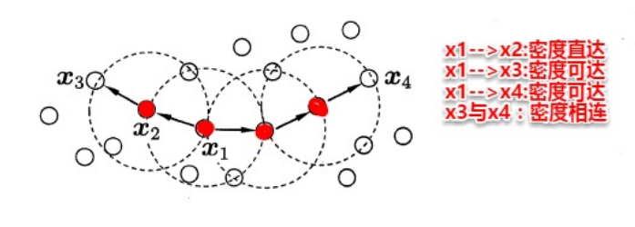

​		简单来理解DBSCAN便是：找出一个核心对象所有密度可达的样本集合形成簇。首先从数据集中任选一个核心对象A， 找出所有A密度可达的样本集合，将这些样本形成一个密度相连的类簇，直到所有的核心对象都遍历完。

​		DBSCAN算法 的流程如下图所示：

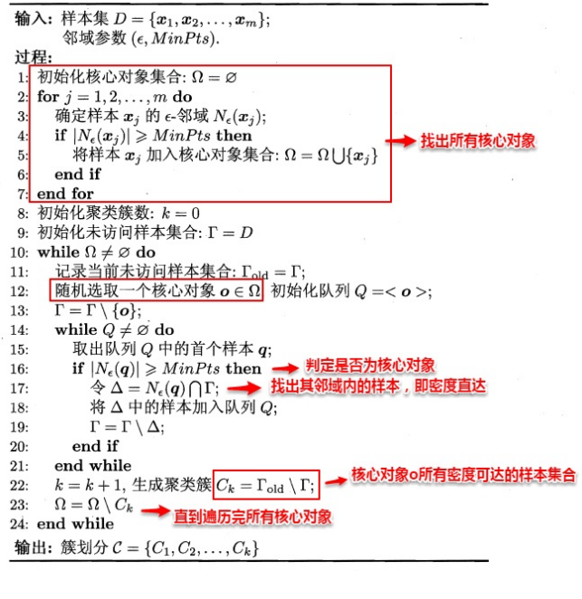

```python
# encoding:utf-8
import matplotlib.pyplot as plt
import random
import numpy as np
import math
from sklearn import datasets
 
list_1 = []
list_2 = []
# 数据集一：随机生成散点图,参数为点的个数
# def scatter(num):
#     for i in range(num):
#         x = random.randint(0, 100)
#         list_1.append(x)
#         y = random.randint(0, 100)
#         list_2.append(y)
#     print(list_1)
#     print(list_2)
#     data = list(zip(list_1, list_2))
#     print(data)
#     #plt.scatter(list_1, list_2)
#     #plt.show()
#     return data
#scatter(50)
 
def loadDataSet(fileName, splitChar='\t'):
    dataSet = []
    with open(fileName) as fr:
        for line in fr.readlines():
            curline = line.strip().split(splitChar)
            fltline = list(map(float, curline))
            dataSet.append(fltline)
    return dataSet
 
# 计算两个点之间的欧式距离，参数为两个元组
def dist(t1, t2):
    dis = math.sqrt((np.power((t1[0]-t2[0]),2) + np.power((t1[1]-t2[1]),2)))
    # print("两点之间的距离为："+str(dis))
    return dis
 
# dis = dist((1,1),(3,4))
# print(dis)
 
 
# DBSCAN算法，参数为数据集，Eps为指定半径参数，MinPts为制定邻域密度阈值
def dbscan(Data, Eps, MinPts):
    num = len(Data)  # 点的个数
    # print("点的个数："+str(num))
    unvisited = [i for i in range(num)]  # 没有访问到的点的列表
    # print(unvisited)
    visited = []  # 已经访问的点的列表
    C = [-1 for i in range(num)]
    # C为输出结果，默认是一个长度为num的值全为-1的列表
    # 用k来标记不同的簇，k = -1表示噪声点
    k = -1
    # 如果还有没访问的点
    while len(unvisited) > 0:
        # 随机选择一个unvisited对象
        p = random.choice(unvisited)
        unvisited.remove(p)
        visited.append(p)
        # N为p的epsilon邻域中的对象的集合
        N = []
        for i in range(num):
            if (dist(Data[i], Data[p]) <= Eps):# and (i!=p):
                N.append(i)
        # 如果p的epsilon邻域中的对象数大于指定阈值，说明p是一个核心对象
        if len(N) >= MinPts:
            k = k+1
            # print(k)
            C[p] = k
            # 对于p的epsilon邻域中的每个对象pi
            for pi in N:
                if pi in unvisited:
                    unvisited.remove(pi)
                    visited.append(pi)
                    # 找到pi的邻域中的核心对象，将这些对象放入N中
                    # M是位于pi的邻域中的点的列表
                    M = []
                    for j in range(num):
                        if (dist(Data[j], Data[pi])<=Eps): #and (j!=pi):
                            M.append(j)
                    if len(M)>=MinPts:
                        for t in M:
                            if t not in N:
                                N.append(t)
                # 若pi不属于任何簇，C[pi] == -1说明C中第pi个值没有改动
                if C[pi] == -1:
                    C[pi] = k
        # 如果p的epsilon邻域中的对象数小于指定阈值，说明p是一个噪声点
        else:
            C[p] = -1
 
    return C
 
 
# 数据集二：788个点
dataSet = loadDataSet('788points.txt', splitChar=',')
C = dbscan(dataSet, 2, 14)
print(C)
x = []
y = []
for data in dataSet:
    x.append(data[0])
    y.append(data[1])
plt.figure(figsize=(8, 6), dpi=80)
plt.scatter(x,y, c=C, marker='o')
plt.show()
# print(x)
# print(y)
```

```python
import numpy as np
from sklearn.cluster import DBSCAN
from sklearn import metrics
from sklearn.datasets.samples_generator import make_blobs
from sklearn.preprocessing import StandardScaler

centers = [[1, 1], [-1, -1], [1, -1]]  # 生成聚类中心点
X, labels_true = make_blobs(n_samples=750, centers=centers, cluster_std=0.4,random_state=0) 
# 生成样本数据集

X = StandardScaler().fit_transform(X) 
# StandardScaler 标准化处理。且是针对每一个特征维度来做的，而不是针对样本。


# 调用密度聚类  DBSCAN
db = DBSCAN(eps=0.3, min_samples=10).fit(X)
# print(db.labels_)  # db.labels_为所有样本的聚类索引，没有聚类索引为-1
# print(db.core_sample_indices_) # 所有核心样本的索引

core_samples_mask = np.zeros_like(db.labels_, dtype=bool)  # 设置一个样本个数长度的全false向量
core_samples_mask[db.core_sample_indices_] = True #将核心样本部分设置为true
labels = db.labels_

n_clusters_ = len(set(labels)) - (1 if -1 in labels else 0)
# 获取聚类个数。（聚类结果中-1表示没有聚类为离散点）

# 模型评估
print('估计的聚类个数为: %d' % n_clusters_)
print("同质性: %0.3f" % metrics.homogeneity_score(labels_true, labels))  # 每个群集只包含单个类的成员。
print("完整性: %0.3f" % metrics.completeness_score(labels_true, labels))  # 给定类的所有成员都分配给同一个群集。
print("V-measure: %0.3f" % metrics.v_measure_score(labels_true, labels))  # 同质性和完整性的调和平均
print("调整兰德指数: %0.3f" % metrics.adjusted_rand_score(labels_true, labels))
print("调整互信息: %0.3f" % metrics.adjusted_mutual_info_score(labels_true, labels))
print("轮廓系数: %0.3f" % metrics.silhouette_score(X, labels))


# Plot result
import matplotlib.pyplot as plt
import seaborn as sns 
%matplotlib inline
sns.set(font='SimHei',style='ticks')

unique_labels = set(labels)
colors = [plt.cm.Spectral(each) for each in np.linspace(0, 1, len(unique_labels))]

plt.figure(figsize=(10,6))
for k, col in zip(unique_labels, colors):
    if k == -1:  # 聚类结果为-1的样本为离散点
        # 使用黑色绘制离散点
        col = [0, 0, 0, 1]

    class_member_mask = (labels == k)  # 将所有属于该聚类的样本位置置为true

    xy = X[class_member_mask & core_samples_mask]  # 将所有属于该类的核心样本取出，使用大图标绘制
    plt.plot(xy[:, 0], xy[:, 1], 'o', markerfacecolor=tuple(col),markeredgecolor='k', markersize=14)

    xy = X[class_member_mask & ~core_samples_mask]  # 将所有属于该类的非核心样本取出，使用小图标绘制
    plt.plot(xy[:, 0], xy[:, 1], 'o', markerfacecolor=tuple(col),markeredgecolor='k', markersize=6)

plt.title('Estimated number of clusters: %d' % n_clusters_)
sns.despine()
```


[数据](DBSCAN)

### 5、层次聚类

​		层次聚类是一种基于树形结构的聚类方法，常用的是自底向上的结合策略（AGNES算法）。

​		假设有N个待聚类的样本， 其基本步骤是：

1.初始化:把每个样本归为一类，计算每两个类之间的距离，也就是样本与样本之间的相似度;

2.寻找各个类之间最近的两个类，把他们归为一类（这样类 的总数就少了一个）

3.重新计算新生成的这个类与各个旧类之间的相似度；

4.重复2和3直到所有样本点都归为一类，结束。

​		计算两个类簇的相似度的度量方法：
$$
\begin{aligned}
&●单链接（single-linkage）:取类间最小距离\\
&{\kern 12pt}最小距离:{d_{\min }}\left( {{C_i},{C_j}} \right) = {\min _{x \in {C_i},z \in {C_j}}}dist\left( {x,z} \right)\\
&●全链接（complete-linkage）:取类间最大距离\\
&{\kern 12pt}最大距离:{d_{\max }}\left( {{C_i},{C_j}} \right) = {\max _{x \in {C_i},z \in {C_j}}}dist\left( {x,z} \right)\\
&● 均链接（average-linkage）:取类间两两的平均距离\\
&{\kern 12pt}平均距离:{d_{avg}}\left( {{C_i},{C_j}} \right) = \frac{1}{{\left| {{C_i}} \right|\left| {{C_j}} \right|}}\sum\limits_{x \in {C_i}} {\sum\limits_{z \in {C_j}} {dist\left( {x,z} \right)} } 

\end{aligned}
$$
​		单链接的包容性极强，稍微有点暧昧就当做是自己人了，全链接则是坚持到底，只要存在缺点就坚决不合并，均连接则是从全局出发顾全大局。

​		层次聚类法的算法流程如下所示：

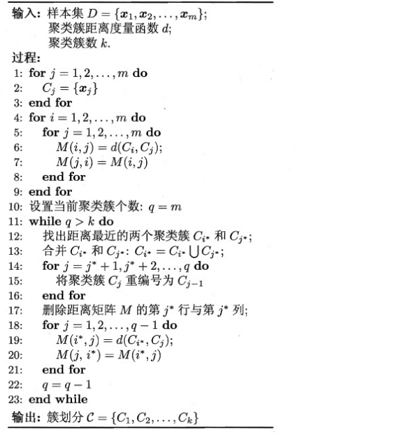

[详细代码](层次聚类树状图\plot_agglomerative_dendrogram.ipynb)

## 十一、降维和度量学习

### 1、 K近邻学习

### 2、 MDS算法

### 3、主成分分析（PCA）

### 4、核化线性降维

### 5、流形学习

### 6、度量学习

## 十二、特征选择与稀疏学习

### 1、子集搜索与评价

### 2、 过滤式选择（Relief）

### 3、包裹式选择（LVW）

### 4、嵌入式选择与正则化

### 5、 稀疏表示与字典学习

### 6、压缩感知

## 十三、计算学习理论

### 1、PAC学习

### 2、有限假设空间

### 3、VC维

### 4、稳定性

## 十四、半监督学习

### 1、 生成式方法

### 2、 半监督SVM

### 3、 基于分歧的方法

### 4、半监督聚类

## 十五、概率图模型

### 1、隐马尔可夫模型(HMM)

### 2、马尔可夫随机场（MRF）

### 3、条件随机场（CRF）

### 4、学习与推断

### 5、LDA话题模型

## 十六、强化学习

[强化学习-Reinforcement learning | RL](https://easyai.tech/ai-definition/reinforcement-learning/)

### 1、基本要素

### 2、K摇摆赌博机

### 3、有模型学习

### 4、蒙特卡罗强化学习

### 5、AlphaGo原理浅析

